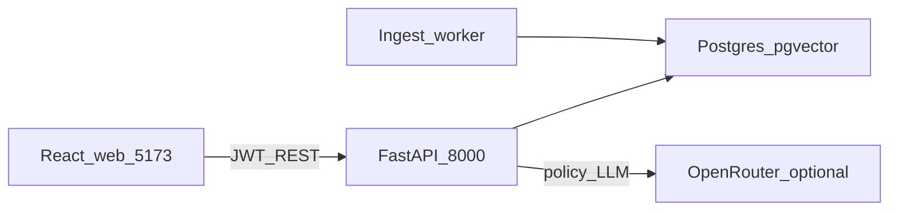

# Agentic Education Platform

Multi-role platform for common curriculum and student evaluation. Administrators publish a shared
**SourceCurriculum**; enrolled students study through a private **StudentLearningDirectory** that
references published versions (not copies). Teachers consume class evidence (UI is mock-only in the
POC). See the [documentation hub](docs/README.md) for vision, reading paths, and the full matrix.

```text
SourceCurriculum (shared, admin-owned)
└── AcademicPeriod → Grade → Subject → Topic → Subtopic
    ├── published lesson materials
    └── common mastery quiz

StudentLearningDirectory (private, per student)
└── same tree, with progress + quiz attempts
    (references published sources; no duplicated files)
```

## Architecture (POC today)



| Module | Role |
| --- | --- |
| `auth` | JWT access/refresh, roles, demo accounts |
| `academics` | Periods, grades, subjects, enrollments, learning directory, demo bootstrap/reset |
| `materials` | Curriculum seed, lessons, progress, PDF ingest hooks |
| `assessments` | Quizzes and scored attempts (no answer keys on student APIs) |
| `rag` | Knowledge docs, chunking, pgvector embeddings, ingest jobs |
| `assistant` | Admin policy chats (LangGraph: inject → validate → retrieve → summarize) |
| `workers` | Postgres claim worker for PDF ingest |

**Not in POC:** teacher backend APIs, four-pillar evaluation snapshots, MinIO, React Native, student
grounded assistant.

## What’s built

| Role / area | Status |
| --- | --- |
| **Student** — enroll → learning directory → lesson → quiz → score | **Built** |
| **Admin** — materials browse + curriculum PDF upload, knowledge docs, policy assistant | **Built** |
| **Teacher** — `/teacher/*` workspace | **Mock** (frontend fixtures only) |
| JWT auth + enrollment gate | **Built** |
| Curriculum seed (`docs/curriculum/` → Postgres) | **Built** |
| Ingestion + pgvector indexing | **Built** |
| Four-pillar analytics, MinIO, React Native, student grounded assistant | **Deferred** |

Full matrix: [docs/README.md#implementation-status](docs/README.md#implementation-status).

## Start locally

**Prerequisites:** `uv`, Docker (Compose), Node 18+.

```bash
# macOS/Linux
./scripts/setup-macos.sh

# Windows PowerShell
./scripts/setup-windows.ps1
```

```bash
# 1. Postgres + pgvector
docker compose up -d postgres
# wait until healthy, then:

# 2. Migrate (API auto-seeds from docs/curriculum/ when no topics exist)
cd backend
uv run alembic upgrade head
# optional manual seed:
# uv run python -m education_platform.modules.materials.seed

# 3. API
uv run uvicorn education_platform.main:app --reload --host 127.0.0.1 --port 8000

# 4. Frontend (separate terminal)
cd frontend
cp .env.example .env   # VITE_API_BASE_URL=http://127.0.0.1:8000
npm install
npm run dev
```

Optional:

- Ingest worker (admin PDF upload): `cd backend && uv run python -m education_platform.workers`
- Live policy LLM stages: set `OPENROUTER_API_KEY` in `backend/.env` (heuristic + stub summarize still run without it)

| Service | URL |
| --- | --- |
| API docs | http://127.0.0.1:8000/docs |
| Web app | http://localhost:5173 |

Demo accounts: `student@demo.school` / `demo1234`, `admin@demo.school` / `demo1234`.

Schema browser: [docs/design/relational-schema.html](docs/design/relational-schema.html).

## How to use

### Student

1. Sign in as `student@demo.school` / `demo1234`
2. Enroll in Grade 8 Math, or use **Quick demo**
3. Open a topic lesson (slides), then start the unit quiz
4. Submit answers and review the score (pass ≥ 70%). Correct option labels are never shown.

### Admin

1. Sign in as `admin@demo.school` / `demo1234`
2. `/admin/materials` — browse the curriculum tree; upload curriculum PDFs and poll ingest status
3. `/admin/documents` — upload/list knowledge PDFs
4. `/admin/policy` — multi-chat policy assistant (retrieval over indexed docs; LLM optional via OpenRouter)

### Teacher

DEV **Enter as teacher** only — fixture UI, no teacher backend APIs.

## Example requests

**Student** — provision, login, enroll, learning directory:

```bash
curl -X POST http://127.0.0.1:8000/api/v1/auth/provision-student \
  -H 'Content-Type: application/json' \
  -d '{"email":"student@example.com","password":"password123","full_name":"Asha","student_identifier":"S1"}'
TOKEN=$(curl -s -X POST http://127.0.0.1:8000/api/v1/auth/login \
  -H 'Content-Type: application/json' \
  -d '{"email":"student@example.com","password":"password123"}' | python -c 'import sys,json; print(json.load(sys.stdin)["access_token"])')
curl -X POST http://127.0.0.1:8000/api/v1/me/enrollments/poc-math \
  -H "Authorization: Bearer $TOKEN" -H 'Content-Type: application/json' -d '{"confirm":true}'
curl http://127.0.0.1:8000/api/v1/me/learning-directory -H "Authorization: Bearer $TOKEN"
```

**Admin** — login without enrollment, browse learning directory:

```bash
ADMIN_TOKEN=$(curl -s -X POST http://127.0.0.1:8000/api/v1/auth/login \
  -H 'Content-Type: application/json' \
  -d '{"email":"admin@demo.school","password":"demo1234"}' | python -c 'import sys,json; print(json.load(sys.stdin)["access_token"])')
curl http://127.0.0.1:8000/api/v1/me/learning-directory -H "Authorization: Bearer $ADMIN_TOKEN"
```

**Quick demo** — bootstrap or reset enrollments/progress in development:

```bash
curl -X POST http://127.0.0.1:8000/api/v1/me/demo/bootstrap \
  -H "Authorization: Bearer $TOKEN"
curl -X POST http://127.0.0.1:8000/api/v1/me/demo/reset \
  -H "Authorization: Bearer $TOKEN"
```

Legacy flat list (prefer learning-directory): `GET /api/v1/materials`.

```bash
curl http://127.0.0.1:8000/health
```

## Quality checks

```bash
cd backend
uv run ruff format --check .
uv run ruff check .
uv run mypy src
uv run alembic upgrade head
uv run pytest
```

```bash
cd frontend
npm test
```

## Documentation

| Doc | Contents |
| --- | --- |
| [Documentation hub](docs/README.md) | Vision, map, implementation matrix |
| [Architecture](docs/architecture/README.md) | Diagrams and HTML overview |
| [Design specs](docs/design/README.md) | Component contracts and data model |
| [Backend README](backend/README.md) | API modules and access rules |
| [Frontend README](frontend/README.md) | Routes and role flows |
| [Schema HTML](docs/design/relational-schema.html) | Visual relational schema |
