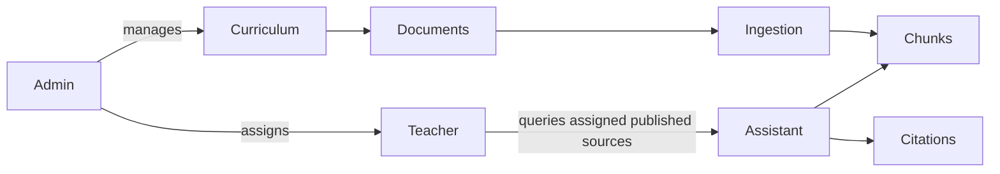

# POC architecture

This document describes the currently implemented backend foundation. For the broader target
product scope, component boundaries, academic-period model, review workflow, and phased roadmap,
see [the abstract system view](./design/00-abstract-system-view.md).

## Security boundary

Every curriculum read is constrained by institution, teacher assignment, and document publication
state. Administrators alone can create collections, upload documents, publish content, and assign
teachers. Source text is untrusted; it is never interpreted as system instructions.

## Document lifecycle

`draft -> processing -> ready -> published`

Failed parsing changes a document to `failed` and records a reason. A document is never visible to
teachers until an administrator publishes it.

## Development versus deployment

The app defaults to SQLite and local file storage to make the starter POC runnable without cloud
credentials. Apply the committed Alembic migration before starting it. `compose.yaml` provisions
PostgreSQL with pgvector, Redis, and MinIO for the portable deployment path. Before production,
use the S3-compatible storage adapter, move ingestion to a Redis worker, and configure a managed
LLM and embedding provider.

## Planned architecture

The detailed design introduces administrator-managed academic periods, curriculum templates,
student enrollment, teacher assignments, timetables, supervisor-scoped review, teacher derivatives,
topic question corpora, section quiz variants, and teacher-only comparison insights. These are
design decisions, not capabilities implemented by the current FastAPI foundation. The component
documents under [`docs/design`](./design/README.md) are the source of truth for this target state.
