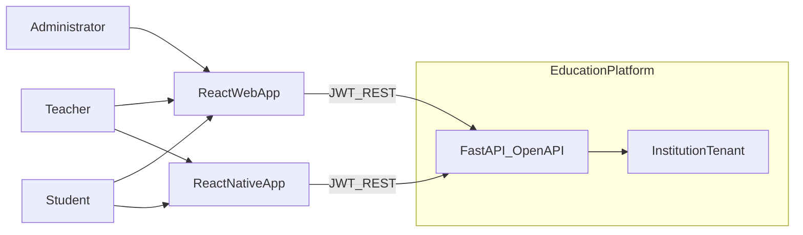
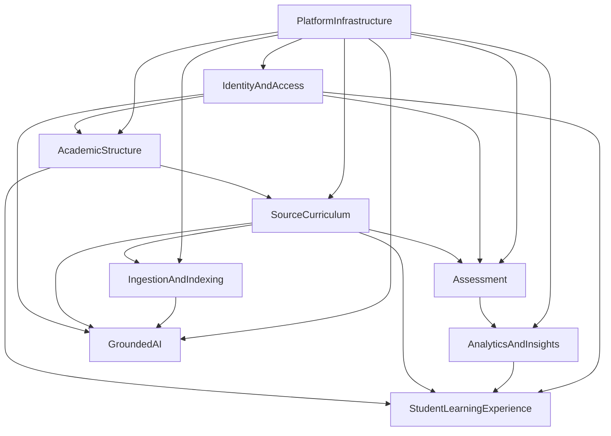
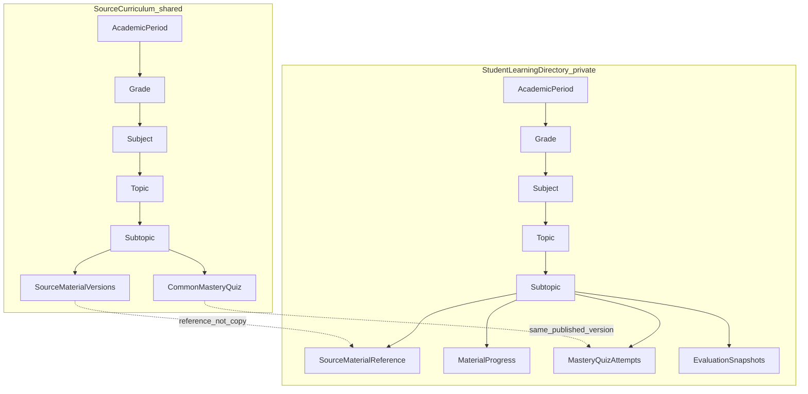
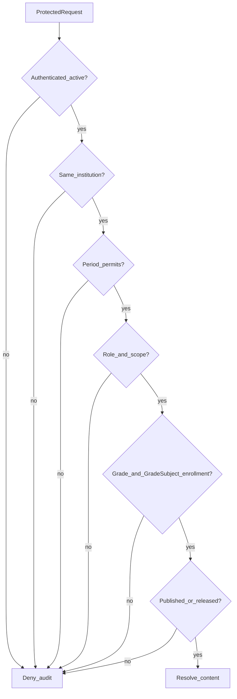
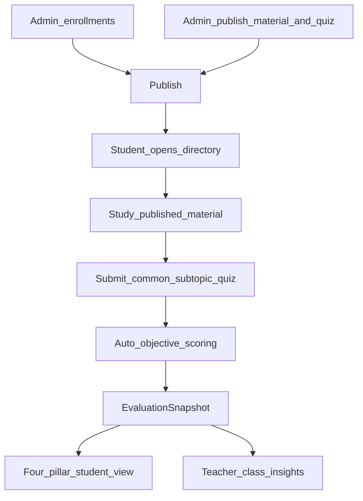
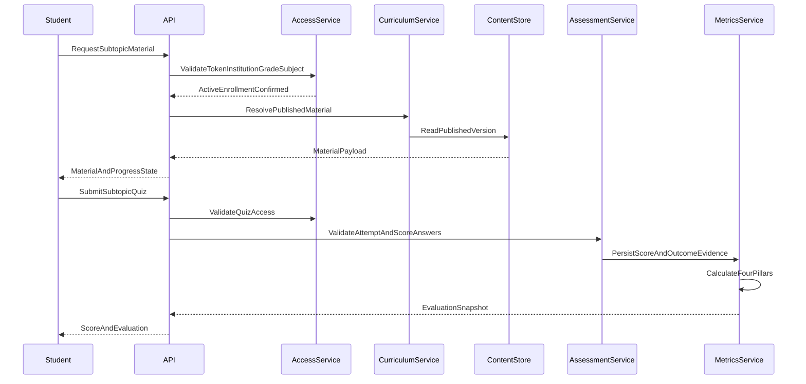
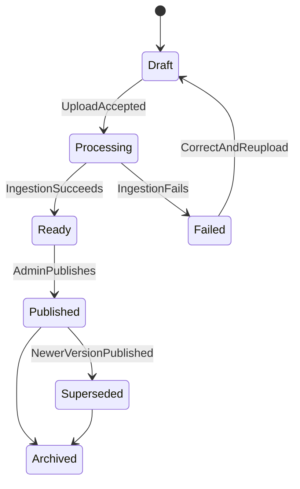
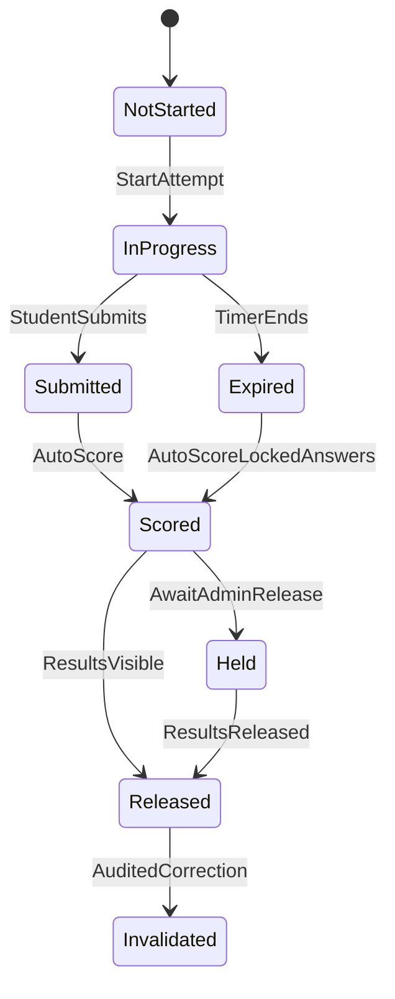
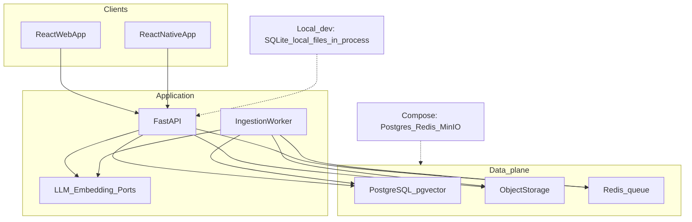
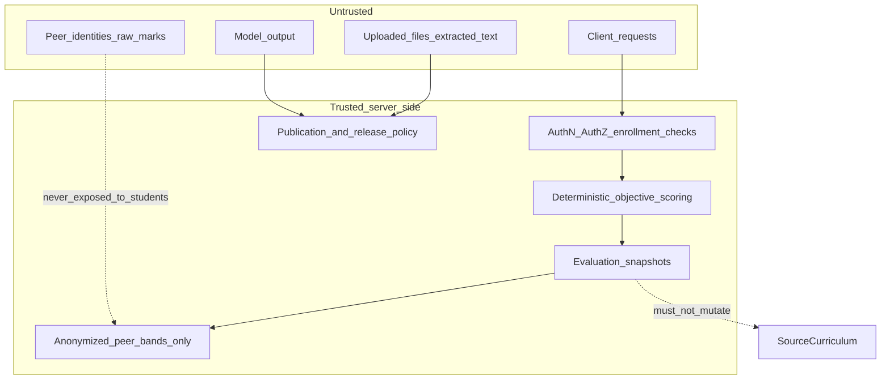

# Architecture

Target-design diagrams. Narrative overview: [project-overview.html](./project-overview.html).
Component detail: [design docs](./design/README.md).

| View | Design |
| --- | --- |
| Context / components | [00 abstract system view](./design/00-abstract-system-view.md) |
| Student directory | [01 student learning experience](./design/01-student-learning-experience.md) |
| Identity / auth gate | [02 identity tenancy authorization](./design/02-identity-tenancy-and-authorization.md) |
| Academic structure | [03 academic structure enrollment](./design/03-academic-structure-enrollment-and-timetable.md) |
| Source / material lifecycle | [04 material lifecycle](./design/04-material-lifecycle-and-ai-artifacts.md) |
| Assessment | [05 common mastery quizzes](./design/05-assessment-common-subtopic-mastery-quizzes.md) |
| Analytics | [06 analytics comparison](./design/06-analytics-and-comparison-insights.md) |

## 1. System context

## 2. Bounded components

## 3. Two directories

## 4. Authorization gate

## 5. Study to evaluation pipeline

## 6. Request lifecycle

## 7. Material lifecycle

## 8. Quiz attempt lifecycle

## 9. Infrastructure

## 10. Trust boundaries

