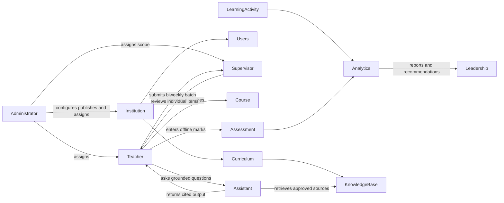
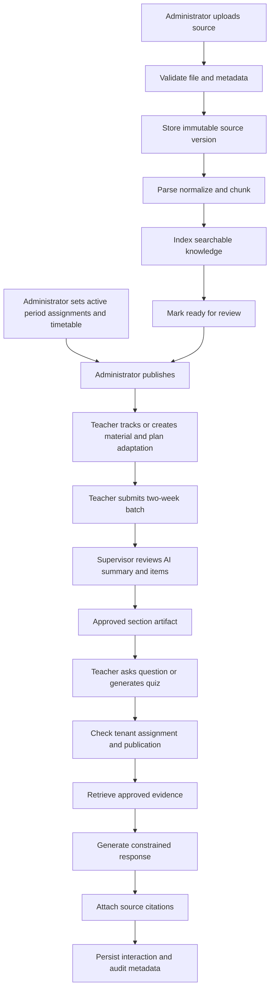

# Abstract System View

## 1. Purpose

The Agentic Platform for Automated Education Management and Analytics helps educational
institutions improve teaching quality, reduce administrative effort, and make learning outcomes
visible through a shared, permission-aware platform.

The platform combines institutional curriculum data, learning activity data, and assessment data.
AI capabilities are grounded in institution-approved content and operate within the user's role and
institutional access boundaries.

The initial POC proves this governed teacher workflow:

> An administrator creates the active academic period, curriculum template, sections, student
> roster, teacher assignments, and timetable. The institution publishes trusted baseline materials
> and plans. A teacher prepares two weeks of section-specific, AI-assisted material and plan
> adaptations, submits them to the assigned supervisor, and uses approved content to teach and
> generate comparable section quiz variants.

## 2. Product capabilities

### 2.1 Identity and institution management

- Administrator, teacher, and supervisor accounts
- Institution-level tenant isolation
- Role-based access control
- Password, session, and token lifecycle management
- Audit history for sensitive actions

Future roles:

- Student
- Parent
- TPO or academic leadership
- Institution operator

### 2.2 Curriculum and knowledge management

- Subjects, courses, modules, learning outcomes, and curriculum collections
- Academic periods, grades, sections, student enrollments, and teacher assignments
- One active academic period per institution, with historical periods retained as read-only archives
- Administrator-managed source documents
- Document versions, metadata, ownership, and lifecycle state
- Institution-published baseline materials and master plans
- Teacher derivative materials, section plan adaptations, and biweekly supervisor review batches
- Publication and archival controls
- Searchable source citations

### 2.3 AI teaching assistant

- Question answering over authorized institution baselines and approved teacher content
- Source-grounded answers with citations
- Explicit insufficient-evidence responses
- Lesson-plan, worksheet, slide-deck outline, and objective-question draft generation
- Learning-objective and activity generation
- Prompt and model version tracking

Future AI workflows:

- Content transformation into summaries, examples, and study material
- Question and quiz generation
- Rubric-aware evaluation assistance
- Personalized learning-path recommendations
- Academic and leadership insight generation

### 2.4 Assessment management

- Topic-scoped question corpus with easy, medium, hard, and extra-hard questions
- Teacher-reviewed, supervisor-approved AI question drafts
- Grade–Subject–Topic master assessment blueprints
- One comparable offline quiz variant per section
- Teacher-entered total marks and missing-submission status
- Teacher-only cross-section comparison insight for assigned sections

Online student quiz delivery, automatic objective scoring, question-level response analytics, and
subjective evaluation remain future phases.

### 2.5 Learning analytics

- Course activity and content engagement
- Login and participation signals
- Quiz and exam performance
- Outcome and skill progression
- Teacher dashboards
- Academic leadership dashboards
- Student reports and personalized feedback

Analytics should distinguish observed facts, derived metrics, and AI-generated interpretations.

### 2.6 Collaboration and learner services

- Discussion forums
- Teacher and student feedback
- Certificates and completion records
- Notifications and reminders
- Parent-facing progress views

These capabilities depend on the student and course-enrollment model, so they follow the POC.

### 2.7 Platform operations

- API and Flutter client contract
- Background processing for ingestion and analytics
- Object storage for source files
- Relational storage for transactional data
- Vector and full-text retrieval
- Observability, audit logs, backups, and recovery
- Deployment and environment management

## 3. Abstract actors

## 4. Abstract bounded components

### A. Identity and access

Owns users, roles, institutions, sessions, authorization policies, and audit events. Every other
component depends on this boundary.

### B. Academic structure

Owns academic periods, grades, sections, subjects, topics, learning outcomes, student enrollments,
teacher assignments, and timetable slots. It provides the context that makes curriculum and
analytics meaningful.

### C. Curriculum and content

Owns institution baselines, teacher derivatives, plan adaptations, versions, review batches,
metadata, and publication/approval state. It is the authority for whether content may be used by
teachers or AI workflows.

### D. Ingestion and knowledge indexing

Converts approved source files into normalized text, chunks, metadata, embeddings, and retrieval
indexes. It is asynchronous, retryable, observable, and idempotent.

### E. AI orchestration

Coordinates retrieval, prompt construction, model calls, structured output validation, citations,
and safety policies. It must not decide authorization; access is enforced before retrieval.

### F. Assessment

Owns topic-scoped question corpora, master blueprints, section variants, offline mark entries, and
comparison rules. Online attempts, automatic scoring, rubrics, and moderation are future scope.

### G. Analytics and insights

Owns event collection, metric definitions, aggregations, reporting views, and carefully labeled AI
insights. It should not mutate academic records without an explicit workflow.

### H. Collaboration and notifications

Owns discussion, feedback, certificates, reminders, and delivery preferences.

### I. Platform infrastructure

Provides storage, queues, database access, observability, configuration, deployment, and recovery
mechanisms without embedding academic business rules.

## 5. Core data flow

## 6. Trust boundaries

1. **Client to API:** clients are untrusted; authentication and authorization are server-side.
2. **Institution to institution:** tenant identifiers are never accepted as proof of access.
3. **Uploaded files to application:** files and extracted text are untrusted data.
4. **Retrieved text to model:** retrieved content cannot override system or application policy.
5. **Model output to platform:** output is untrusted until schema validation and policy checks.
6. **Analytics to academic records:** derived insights cannot silently alter source records.

## 7. POC boundary

### Included

- Administrator, teacher, and supervisor roles
- Institution-aware JWT authentication
- Multiple academic periods with one active period per institution
- Administrator-managed curriculum templates, sections, student CSV import, teaching assignments,
  and timetable CSV/manual setup
- PDF, DOCX, and text ingestion
- Institution baseline publication, teacher derivatives, biweekly review batches, and
  item-level supervisor approval
- Assignment- and supervisor-scope authorization checks
- Grounded Q&A plus lesson-plan, worksheet, slide-outline, and objective-question drafts
- Topic-scoped question corpus, master blueprints, section quiz variants, and offline mark entry
- Teacher-only comparison insights for assigned sections
- Citations, audit metadata, and testable access boundaries
- FastAPI/OpenAPI contract for a Flutter client

### Deferred

- Student login, online learner experience, and per-student quiz variants
- Parent and TPO portals
- Online quiz delivery, automatic scoring, and question-level response analytics
- Predictive analytics and recommendation systems
- Forums and certifications
- Enterprise SSO
- Production cloud deployment, disaster recovery, and compliance certification

## 8. Design principles

- **Authorization before retrieval:** the assistant can only retrieve content the user may access.
- **Grounded by default:** generated educational content should identify its supporting sources.
- **Human approval for publication:** administrators control what becomes institutionally trusted.
- **Explicit state machines:** processing, publishing, assessment, and certification states are
  observable and auditable.
- **Provider-neutral AI:** model vendors can change without changing academic domain logic.
- **Facts before interpretation:** analytics must preserve the distinction between source data,
  computed metrics, and generated explanations.
- **Portable infrastructure:** local development should use replaceable adapters for production
  services.
- **Incremental delivery:** each phase must provide a demonstrable end-to-end workflow.

## 9. Open design questions

These questions should be resolved in the component documents:

- Is one repository sufficient, or should Flutter and backend be separate repositories?
- What institution hierarchy is required: institution, campus, department, program, or class?
- Which curriculum standards and learning-outcome taxonomies must be supported?
- Which file types require OCR, table extraction, or image understanding?
- Which LLM and embedding providers are acceptable for institutional data?
- What evidence threshold should produce an insufficient-evidence response?
- Which analytics metrics are authoritative and who approves their definitions?
- What retention, deletion, export, and consent rules apply to student data?
- Which workflows require synchronous responses versus background jobs?

## 10. Component document template

Every detailed design document should use this structure:

1. Scope and non-goals
2. Actors and authorization
3. User workflows
4. Domain concepts and state transitions
5. API and event contracts
6. Data ownership and persistence
7. Failure handling and observability
8. Security and privacy considerations
9. Testing and acceptance criteria
10. POC versus future phases
11. Open decisions and alternatives
