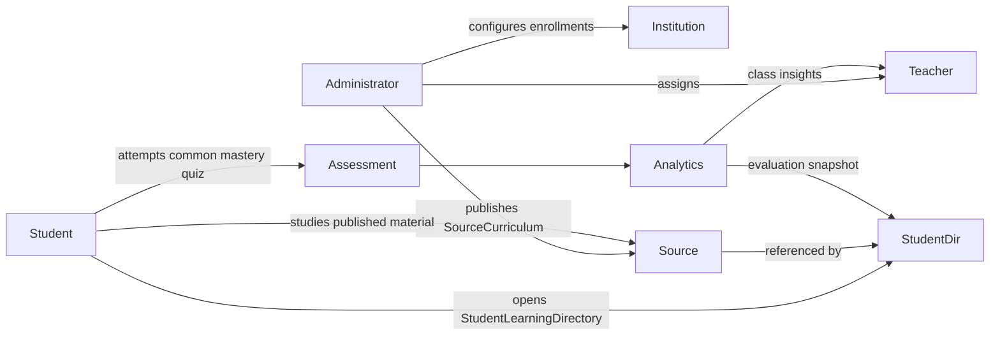
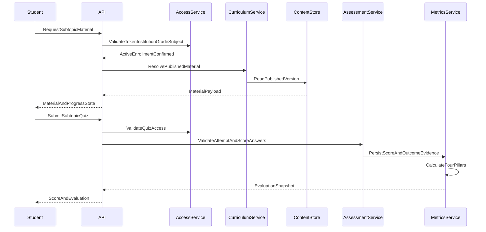
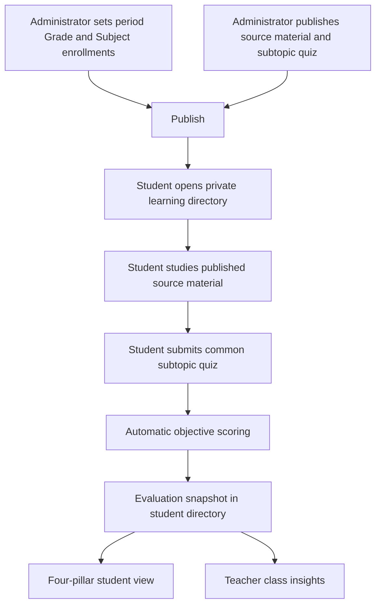

# Abstract System View

## 1. Purpose

The Agentic Platform for Automated Education Management and Analytics helps educational
institutions improve learning outcomes by combining approved curriculum, online learner activity,
assessment evidence, and role-scoped insights for students and teachers.

The platform grounds AI assistance in institution-approved content and operates strictly within
each user's role, enrollment, and institutional access boundaries.

The POC proves a focused common-curriculum and student-evaluation loop:

> An administrator publishes one shared source curriculum for an AcademicPeriod → Grade → Subject.
> Every enrolled student opens a private learning directory that reuses those published source
> versions. After each subtopic, the student completes the same common objective quiz and receives
> an evaluation across four pillars: marks, anonymized peer context, weak subtopics, and progress
> over time. Teachers use assigned-class evidence to support students.

The detailed learner workflow and dashboard contract are defined in
[Student learning experience](./01-student-learning-experience.md).
Diagram-only target architecture views live in
[Architecture](../architecture.md).

## 2. Product model: two directories

The product is built around two complementary folder models. Folders are a navigation/UI concept;
persistence uses relational records and immutable versions.

### 2.1 SourceCurriculum (administrator-owned)

```text
SourceCurriculum
└── AcademicPeriod
    └── Grade
        └── Subject
            └── Topic
                └── Subtopic
                    ├── SourceMaterialVersions
                    │   └── PublishedVersion
                    └── CommonMasteryQuiz
                        └── PublishedVersion
```

One published material version and one common mastery quiz serve every student enrolled in that
Grade–Subject offering. The source directory is never overwritten by learner analytics or AI
output.

### 2.2 StudentLearningDirectory (student-private view)

```text
StudentLearningDirectory
└── StudentId
    └── AcademicPeriod
        └── Grade
            └── Subject
                └── Topic
                    └── Subtopic
                        ├── SourceMaterialReference
                        ├── MaterialProgress
                        ├── MasteryQuizAttempts
                        └── EvaluationSnapshots
```

The student directory is virtual and private. It references published source versions; it does not
duplicate the shared files. Progress, attempts, and evaluation snapshots belong to the student.

Access requires:

```text
active institution
+ active academic period
+ active Grade enrollment
+ active Grade–Subject enrollment
+ published source/quiz version
```

## 3. Product capabilities

### 3.1 Identity and institution management

- Administrator, teacher, and student accounts
- Institution-level tenant isolation
- Role-based and Grade–Subject enrollment-scoped access control
- Password, session, and token lifecycle management
- Audit history for sensitive actions

Future roles:

- Parent / guardian
- Supervisor
- TPO or academic leadership
- Institution operator

### 3.2 Curriculum and knowledge management

- Academic periods, grades, subjects, topics, and subtopics
- Grade enrollment and Grade–Subject enrollment
- Administrator-managed source materials under the Grade–Subject folder hierarchy
- Immutable material and quiz versions with publication and archival controls
- PDF, DOCX, and text ingestion into searchable chunks for grounded AI
- Sections retained only as optional teacher/reporting groupings; they do not change common
  material or quiz assignment in the POC

### 3.3 Assessment management

- One common released online mastery quiz per subtopic
- Objective questions tagged to the subtopic / learning outcome
- Student quiz attempts with automatic objective scoring
- Administrator-controlled result release and audited corrections

Subjective evaluation, per-student quiz variants, adaptive practice from a large corpus, and
AI-generated question authoring remain future phases.

### 3.4 Learning analytics

- Marks and assessment history for each learner
- Anonymized peer comparison bands within the same Grade–Subject–Subtopic mastery quiz
- Subtopic mastery or struggle signals from tagged answers
- Time-series trends across successive subtopic quizzes
- Student dashboards for the four evaluation pillars
- Teacher class insight views for assigned groups

### 3.5 AI assistance (foundation, not POC personalization)

- Grounded retrieval over published source material the requester may access
- Source-grounded answers with citations and insufficient-evidence responses
- Prompt and model version tracking

Future AI workflows:

- Private dynamic material versions generated from source chunks and a student's own evaluation
- Adaptive practice quiz assembly from an approved question corpus
- Teacher lesson and content drafts
- Leadership insight generation

### 3.6 Platform operations

- API and React / React Native client contract
- Background processing for ingestion and analytics
- Object storage for source files
- Relational storage for transactional data
- Vector and full-text retrieval
- Observability, audit logs, backups, and recovery

## 4. Abstract actors



## 5. Abstract bounded components

### A. Identity and access

Owns users, roles, institutions, sessions, authorization policies, and audit events.

### B. Academic structure

Owns academic periods, grades, subjects, topics, subtopics, Grade enrollments, Grade–Subject
enrollments, optional sections, and teaching assignments. Enrollment is the foundation for learner
content access.

### C. Source curriculum and content

Owns the administrator SourceCurriculum hierarchy, material versions, metadata, and publication
state. It is the authority for whether common content may be used by students or AI workflows.

### D. Ingestion and knowledge indexing

Converts published source files into normalized text, chunks, metadata, embeddings, and retrieval
indexes. Asynchronous, retryable, observable, and idempotent.

### E. Assessment

Owns common mastery quizzes, online attempts, automatic objective scoring, result release, and
comparison eligibility metadata.

### F. Analytics and insights

Owns event collection, metric definitions, evaluation snapshots, and student/teacher reporting
views. It must not mutate source curriculum records.

### G. Student learning experience

Owns the private StudentLearningDirectory presentation, material progress UX, attempt UX, and
four-pillar dashboard contract. See
[Student learning experience](./01-student-learning-experience.md).

### H. Platform infrastructure

Provides storage, queues, database access, observability, configuration, and deployment mechanisms
without embedding academic business rules.

## 6. Technical request lifecycle

Authorization occurs before content lookup. Client-supplied grade, subject, or student identifiers
never grant access by themselves.



Core product data flow:



## 7. Trust boundaries

1. **Client to API:** clients are untrusted; authentication and authorization are server-side.
2. **Institution to institution:** tenant identifiers are never accepted as proof of access.
3. **Uploaded files to application:** files and extracted text are untrusted data.
4. **Retrieved text to model:** retrieved content cannot override system or application policy.
5. **Model output to platform:** output is untrusted until schema validation and policy checks.
6. **Analytics to academic records:** derived insights cannot silently alter source curriculum.
7. **Peer analytics to learners:** anonymized aggregates only; never classmate identities or raw
   marks.
8. **Student directories:** one student's progress, attempts, and evaluation snapshots are never
   visible to another student.

## 8. POC boundary

### Included

- Administrator, teacher, and student roles
- Institution-aware JWT authentication
- Multiple academic periods with one active period per institution
- Administrator-managed Grade / Subject / Topic / Subtopic source folders
- Student Grade enrollment and Grade–Subject enrollment
- Administrator publication of common source materials and one common mastery quiz per subtopic
- Enrollment-scoped authorization before material or quiz access
- Online objective attempts with automatic scoring
- StudentLearningDirectory with progress, attempts, and four-pillar evaluation snapshots
- Teacher class insights for assigned groups
- Audit metadata and testable access boundaries
- FastAPI/OpenAPI contract for React web and React Native clients

### Deferred

- Parent portal and supervisor workflow
- Teacher-authored derivatives and section-specific material/quiz assignments
- Private AI-generated dynamic material versions
- Adaptive practice quizzes assembled from a large question corpus
- Subjective, essay, and handwritten evaluation
- Predictive analytics and causal impact claims
- Forums, certifications, enterprise SSO
- Production cloud deployment, disaster recovery, and compliance certification
- TPO/leadership institution-wide dashboards

## 9. Design principles

- **Two directories:** SourceCurriculum is shared and immutable after publish; StudentLearningDirectory
  is private and progress-owned.
- **Common material first:** the administrator publishes one trusted material and quiz per subtopic
  before student evaluation begins.
- **Learner evaluation first:** each POC increment strengthens study → quiz → four-pillar evidence.
- **Authorization before retrieval:** content and AI context require active Grade–Subject enrollment.
- **Facts before interpretation:** analytics distinguish source facts, calculated metrics, and any
  later AI wording.
- **No curriculum mutation from analytics:** student evidence must not rewrite the common source.
- **Portable infrastructure:** local development uses replaceable adapters for production services.
- **Incremental delivery:** each phase must provide a demonstrable end-to-end workflow.

## 10. Open design questions

- Is one repository sufficient, or should React, React Native, and backend be separate repositories?
- Which file types require OCR, table extraction, or image understanding?
- Which LLM and embedding providers are acceptable for institutional data?
- Immediate quiz-result release versus administrator-gated release as the institution default?
- Should the next subtopic unlock only after the prior quiz is submitted, or remain open browsing?
- What retention, deletion, export, and consent rules apply to student attempt data?

## 11. Component document template

Every detailed design document should use this structure:

1. Scope and non-goals
2. Actors and authorization
3. User workflows
4. Domain concepts and state transitions
5. API and event contracts
6. Data ownership and persistence
7. Failure handling and observability
8. Security and privacy considerations
9. Testing and acceptance criteria
10. POC versus future phases
11. Open decisions and alternatives
