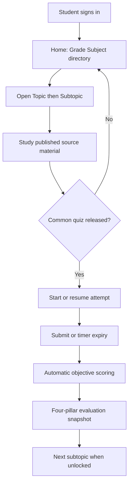
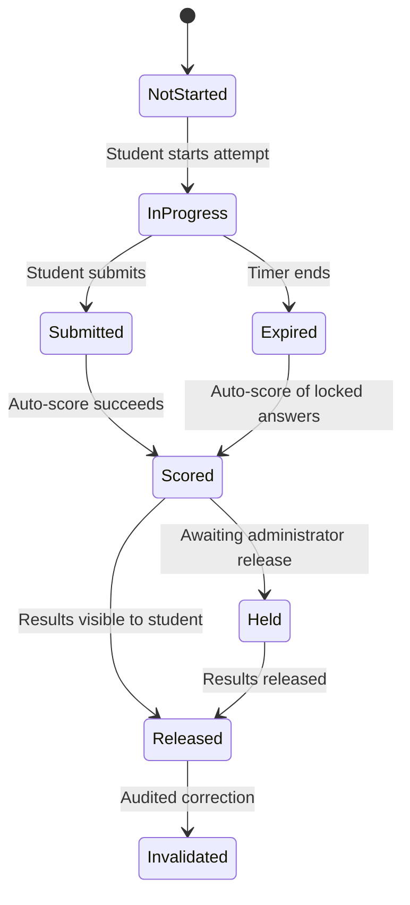

# Student Learning Experience

## 1. Scope and non-goals

This component defines the student-facing learning loop for the common-curriculum evaluation POC.
It is the source of truth for the private **StudentLearningDirectory**, progress states, attempt
UX, and the four-pillar evaluation presented to a student.

Primary learner flow:

```text
Sign in
  -> open private AcademicPeriod / Grade / Subject directory
  -> open Topic / Subtopic
  -> study administrator-published source material (referenced, not copied)
  -> take the common mastery quiz for that subtopic
  -> receive marks, peer context, weak-subtopic evidence, and progress over time
  -> continue to the next subtopic
```

This document owns:

- student home and Grade–Subject directory navigation;
- material study and completion signals;
- quiz attempt lifecycle from the learner perspective;
- learner-visible performance views;
- privacy rules for what a student may see about peers.

This document does **not** own:

- academic period or enrollment administration
  ([academic structure](./03-academic-structure-enrollment-and-timetable.md));
- source publication and ingestion
  ([material lifecycle](./04-material-lifecycle-and-ai-artifacts.md));
- quiz authoring and scoring rules
  ([assessment](./05-assessment-common-subtopic-mastery-quizzes.md));
- metric formulas
  ([analytics](./06-analytics-and-comparison-insights.md));
- account provisioning
  ([identity](./02-identity-tenancy-and-authorization.md)).

### Non-goals for the POC

- Adaptive item selection during a live quiz
- Private AI-generated dynamic material versions
- Per-student unique quiz variants
- Subjective or handwritten response grading
- Parent portal and teacher-authored learner material
- Social feeds or peer messaging

## 2. Actors and authorization

| Actor | Access |
| --- | --- |
| Student | Own StudentLearningDirectory, published source references for enrolled Grade–Subject offerings, own quiz attempts, results, and evaluation snapshots |
| Teacher | Assigned group rosters, class aggregates, and individual results for assigned students |
| Administrator | Publishes SourceCurriculum folders, materials, and quizzes; provisions enrollments |

Authorization checks before any learner content is returned:

```text
1. Authenticated active student account
2. Same institution as the resource
3. Active academic period
4. Active Grade enrollment
5. Active Grade–Subject enrollment
6. Resource lifecycle permits learner visibility (published / released)
```

A student never receives another student's identity, raw marks, attempt answers, or ranking list.
Peer comparison is anonymized aggregate context only.

## 3. User workflows

### 3.1 Sign-in and home

1. The student authenticates with institution-provisioned credentials.
2. The platform resolves the active academic period plus active Grade and Grade–Subject enrollments.
3. The home view shows:
   - current grade and enrolled subjects;
   - subtopics in progress;
   - quizzes available or due;
   - latest score trend summary.

If either required enrollment is missing, the home view shows an explicit blocked state and does
not expose curriculum or quizzes.

### 3.2 Navigate the private learning directory

```text
StudentLearningDirectory
└── StudentId
    └── AcademicPeriod
        └── Grade
            └── Subject
                └── Topic
                    └── Subtopic
                        ├── SourceMaterialReference
                        ├── MaterialProgress
                        ├── MasteryQuizAttempts
                        └── EvaluationSnapshots
```

1. The student opens a Grade–Subject folder.
2. The platform lists Topics and Subtopics from the SourceCurriculum for that offering.
3. For each subtopic, the student sees material status and quiz status derived from published
   source/quiz versions plus the student's own progress records.

### 3.3 Study published source material

1. The student opens a subtopic material reference.
2. The platform resolves the published SourceMaterialVersion for that Grade–Subject–Subtopic.
3. Progress is recorded: opened, optionally time spent, completed when the completion rule is met.
4. Unpublished content and other Grade–Subject folders remain invisible.

### 3.4 Take the common mastery quiz

1. After material is available, the student opens the released common mastery quiz for the subtopic.
2. The platform creates an attempt only when:
   - the quiz is released for the Grade–Subject–Subtopic;
   - the attempt window is open;
   - the student has remaining allowed attempts;
   - no conflicting in-progress attempt exists.
3. The student answers objective questions within the configured duration.
4. On submit or timer expiry, the platform locks and scores the attempt automatically.
5. Results are shown according to the release policy.

Default progression rule for the POC: the next subtopic becomes available after the prior subtopic
quiz is submitted. Institutions may later relax this to open browsing.

### 3.5 Review the four-pillar evaluation

After results release, the student reviews:

1. **Marks:** score, percentage, and assessment history.
2. **Peer context:** anonymized Grade–Subject cohort band when minimum evidence is available.
3. **Subtopic analysis:** outcomes/tags with low correctness on this quiz.
4. **Progress over time:** score, mastery, and completion trends across subtopic quizzes.

The POC shows evidence rather than generating individualized remedial content. A student may
revisit the same published source material or take an allowed retake.



## 4. Domain concepts and state transitions

### 4.1 Source material reference and progress

| State | Meaning |
| --- | --- |
| Available | Published source version resolvable through enrollment |
| In progress | Student has opened the material |
| Completed | Completion rule satisfied |
| Superseded for new study | Newer published source exists; prior progress retains old version reference |

### 4.2 Quiz attempt



Rules:

- Only one `InProgress` attempt per student per quiz version at a time.
- Answers are immutable after `Submitted` / `Expired`.
- Retakes create a new attempt; prior attempts remain in history.
- Invalidation requires an audited reason and recalculates dependent metrics.

### 4.3 Evaluation snapshot

Each scored released attempt writes a versioned EvaluationSnapshot into the student directory with
the four pillars, metric version, quiz version, and evidence status.

## 5. Student views and dashboard contract

### 5.1 Home dashboard

| Region | Content |
| --- | --- |
| Identity context | Student name, grade, enrolled subjects, active period |
| Continue learning | Next incomplete subtopic material or due quiz |
| Performance snapshot | Latest subject scores and short trend sparkline |
| Attention items | Weak subtopics from recent evaluation snapshots |
| Privacy note | Peer data is anonymized; no classmate names or marks |

### 5.2 Subject / topic workspace

| Region | Content |
| --- | --- |
| Topics / subtopics | Ordered folder navigation from SourceCurriculum |
| Material | Status for the published source reference |
| Quizzes | Status: locked, available, in progress, submitted, results released |
| My results | Attempt list with scores and dates |
| Subtopic mastery | Outcome-level bars or chips for recent evidence |
| Peer context | Cohort percentile band or insufficient-evidence state |
| Next step | Revisit source material, retake if allowed, or continue |

### 5.3 Attempt review screen

- total score and mastery/pass outcome;
- per-question correctness when the quiz policy allows answer review;
- grouping of missed questions by learning outcome / subtopic tag;
- link back to the published source material;
- peer band for this quiz when eligible.

## 6. API and event contracts

| Endpoint concept | Purpose |
| --- | --- |
| `GET /api/v1/student/me/enrollments` | Active period, grade, Grade–Subject enrollments |
| `GET /api/v1/student/directory` | Private Grade–Subject–Topic–Subtopic tree |
| `GET /api/v1/student/subtopics/{id}/material` | Published material after enrollment checks |
| `POST /api/v1/student/subtopics/{id}/material/progress` | Record opened/completed progress |
| `GET /api/v1/student/subtopics/{id}/quiz` | Released common quiz summary |
| `POST /api/v1/student/quizzes/{id}/attempts` | Start attempt |
| `GET /api/v1/student/attempts/{id}` | In-progress or released attempt |
| `PUT /api/v1/student/attempts/{id}/answers` | Save answers while in progress |
| `POST /api/v1/student/attempts/{id}/submit` | Submit attempt |
| `GET /api/v1/student/performance` | Marks, peer band, subtopic mastery, time series |

Domain events:

- `material.opened`, `material.completed`
- `quiz.attempt.started`, `quiz.attempt.submitted`, `quiz.attempt.scored`, `quiz.results.released`
- `evaluation.snapshot.created`

## 7. Data ownership and persistence

| Record | Owner notes |
| --- | --- |
| Material progress | Per student, source material version, timestamps |
| Quiz attempt | Student, quiz version, timing, status |
| Attempt answers | Question version, selected response, score contribution |
| Evaluation snapshot | Four-pillar metrics, metric version, evidence status |

Derived metrics are owned by analytics and read through versioned snapshots.

## 8. Failure handling and observability

| Condition | Student-visible behavior |
| --- | --- |
| Missing Grade or Grade–Subject enrollment | Blocked home state |
| Material not published | Not available; no cross-enrollment existence leak |
| Quiz not released | Locked state with available-from time when configured |
| Attempt window closed | Prevent start; explain window ended |
| Timer expiry | Auto-lock and score answered items |
| Scoring failure | Keep attempt submitted; show temporary results pending |
| Insufficient peer evidence | Show personal metrics only; suppress peer conclusion |

## 9. Security and privacy considerations

- Students see only their own attempts, answers, and evaluation snapshots.
- Peer comparison shows bands or percentiles, never named classmates.
- Teachers may view individual student results only for assigned groups.
- AI retrieval, when used later, may access only published source material and the requesting
  student's own evidence.
- Model output cannot grant quiz access, change scores, or publish curriculum.

## 10. Testing and acceptance criteria

1. An enrolled student signs in and sees only enrolled Grade–Subject folders.
2. A student cannot open unpublished material or other Grade–Subject content.
3. A student can study published subtopic material and complete the common mastery quiz.
4. The platform auto-scores the attempt and stores an evaluation snapshot.
5. The results view presents marks, subtopic correctness, peer band or insufficient evidence, and
   time-series progress when prior attempts exist.
6. Cross-institution and cross-enrollment access attempts are denied and audited.

## 11. POC versus future phases

### POC included

- Student login and Grade–Subject private directory
- Referenced published common source materials
- Common mastery quiz after each subtopic
- Four-pillar evaluation snapshots
- Teacher visibility into assigned-group learner results

### Deferred

- Private dynamic material versions generated from source + evaluation
- Adaptive practice quizzes from a large approved corpus
- Parent views and teacher-authored learner content
- Adaptive testing and live difficulty adjustment during a mastery quiz

## 12. Open decisions and alternatives

- Should material completion require explicit confirmation or an open threshold?
- Immediate result release versus administrator-gated release as the default?
- Maximum retakes per common mastery quiz?
- Peer context as percentile, fixed bands, or both?
