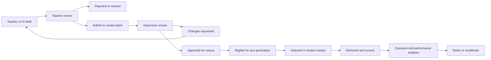
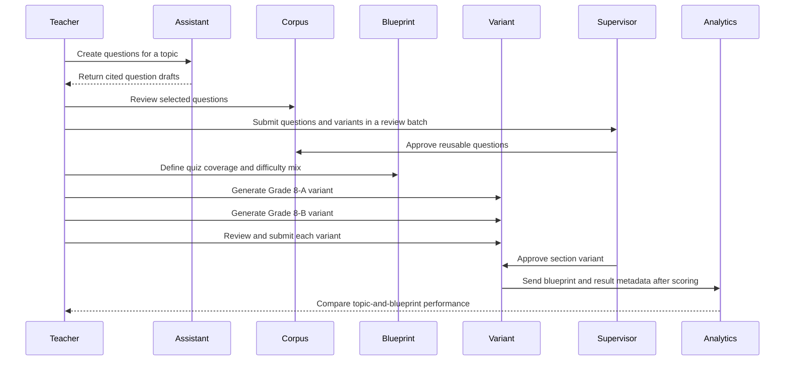

# Assessment Blueprints and Section Quiz Variants

## 1. Scope

This component creates comparable topic assessments without requiring identical question papers for
every section.

The POC supports objective quizzes generated from an approved question corpus. A teacher receives
AI assistance to create questions from authorized curriculum, reviews each draft, and submits
questions and section variants to the assigned supervisor for approval before use.

```text
Academic period · 2026–27
└── Grade 8 Mathematics
    └── Linear equations
        ├── Learning outcomes
        ├── Approved question corpus
        │   ├── Easy
        │   ├── Medium
        │   ├── Hard
        │   └── Extra hard
        ├── Master assessment blueprint
        ├── Grade 8-A quiz variant
        └── Grade 8-B quiz variant
```

## 2. Decisions

| Decision | Choice | Rationale |
| --- | --- | --- |
| Reusable content | Teacher-reviewed, supervisor-approved question corpus | AI accelerates authoring while teacher and supervisor retain academic accountability. |
| First question types | Objective only | Enables reliable automated marking and a small, testable POC. |
| Difficulty levels | Easy, medium, hard, extra hard | Allows a balanced and comparable assessment blueprint. |
| Quiz variation | One variant per section | Limits cross-section question sharing without the complexity of per-student variants. |
| Comparison basis | Shared blueprint and learning outcomes | Equivalent coverage matters more than identical wording. |
| POC delivery | Offline administration with teacher-entered marks | Validates assessment and analytics workflows before student-facing delivery. |
| Comparison visibility | Assigned teacher only | Keeps section performance private during the POC. |
| Variant activation | Supervisor approval through the two-week review batch | Section variants are teacher-created assessment artifacts and follow the same governance workflow. |
| Per-student variants | Deferred | Requires stronger identity, delivery, monitoring, accessibility, and review workflows. |
| Long-form answers | Deferred | Requires rubrics, teacher moderation, and robust evaluation controls. |

## 3. Why a question corpus is required

Giving Grade 8-A and Grade 8-B the exact same quiz makes question sharing likely. Creating an
unstructured new quiz every time makes the classes impossible to compare fairly.

A corpus plus a blueprint solves both problems:

- every variant covers the same intended learning outcomes;
- every variant uses the same marks, time, and difficulty distribution;
- the system can select different approved questions for each section;
- results can be compared at learning-outcome and difficulty level;
- the platform can control question exposure and reuse.

Variants are **comparable**, not necessarily statistically equivalent. The POC must state this
clearly. Formal psychometric calibration is a future capability.

## 4. Core concepts

### Learning outcome

A measurable statement of what a student should be able to demonstrate. For example:

> Solve single-variable linear equations using inverse operations.

Every question must map to at least one learning outcome.

### Question

A reusable, versioned assessment item with:

- Grade and subject;
- topic;
- one or more learning outcomes;
- question type;
- difficulty level;
- prompt;
- answer options and correct answer;
- marks;
- explanation or teacher note;
- source curriculum citations;
- author, reviewer, and approval status;
- exposure and performance history.

### Question corpus

A collection of approved questions for an Academic Period–Grade–Subject–Topic. Questions may be
grouped by difficulty, but difficulty is metadata rather than a physical folder.

### 4.1 Corpus navigation structure

The teacher navigates the corpus through a topic workspace:

```text
Academic period · 2026–27
└── Grade 8 Mathematics
    └── Topics
        └── Linear equations
            └── Quiz corpus
                ├── Easy
                │   ├── Draft questions
                │   ├── Approved questions
                │   └── Retired questions
                ├── Medium
                │   ├── Draft questions
                │   ├── Approved questions
                │   └── Retired questions
                ├── Hard
                │   ├── Draft questions
                │   ├── Approved questions
                │   └── Retired questions
                ├── Extra hard
                │   ├── Draft questions
                │   ├── Approved questions
                │   └── Retired questions
                ├── Master quiz blueprints
                ├── Grade 8-A variants
                ├── Grade 8-B variants
                └── Results and comparison insights
```

This is a logical navigation tree. The underlying data model uses question status and difficulty
attributes so a question can be searched, versioned, retired, and audited without moving physical
files.

### 4.2 Corpus eligibility rules

Only a **supervisor-approved** question is eligible for section-variant generation. An approved question
must have:

- one primary Grade–Subject–Topic;
- one academic period;
- at least one mapped learning outcome;
- one configured difficulty level;
- a supported objective question type;
- a complete answer key and mark value;
- a teacher reviewer and assigned supervisor approval;
- curriculum source citations when AI helped create it;
- no retirement, correction, or active exposure restriction preventing use.

Questions can have multiple tags in the future. For the POC, each question has one primary topic
so the first analytics and navigation model stays clear.

### Assessment blueprint

The master definition of what a quiz measures. It does not contain a fixed paper.

Example:

```text
Grade 8 Mathematics · Linear equations
Duration: 40 minutes
Total marks: 30

Learning outcome: Solve single-variable equations
  - 3 easy questions, 6 marks
  - 4 medium questions, 12 marks
  - 2 hard questions, 8 marks
  - 1 extra-hard question, 4 marks
```

### Section variant

A generated quiz paper for one section, selected from the corpus according to one blueprint.

```text
Master blueprint: Linear equations formative quiz
    -> Grade 8-A variant 01
    -> Grade 8-B variant 02
```

The system stores the exact questions selected, blueprint version, corpus version, generation
rules, and any teacher edits. A variant does not change when the corpus changes later.

## 5. Question lifecycle



### 5.1 AI-assisted authoring flow

1. Teacher chooses Grade, subject, topic, learning outcomes, difficulty, and question type.
2. The system retrieves approved curriculum sources that the teacher may access.
3. AI proposes objective questions with answers, explanations, learning-outcome mappings, and
   citations.
4. The teacher edits, rejects, or adds each reviewed question to a two-week review batch.
5. The assigned supervisor approves, returns, rejects, or defers each question.
6. Supervisor-approved questions enter the teacher's reusable corpus.
7. A teacher can revise a question by creating a new version; existing delivered variants preserve
   the prior version.

AI-generated questions are drafts, never automatically approved assessment items.

## 6. Objective question types in the POC

| Type | Marking approach | Example |
| --- | --- | --- |
| Multiple choice | Exact option match | Select the solution to `2x + 3 = 11` |
| True/false | Exact boolean match | A linear equation may contain a squared term |
| Matching | Exact mapping match | Match equation forms to solution methods |
| Short numeric answer | Normalized numeric comparison | Solve `3x = 15` |

The POC excludes open-ended answers, essays, handwritten work, and AI-only grading.

## 7. POC delivery and marks entry

The teacher generates and reviews a section variant in the platform, then administers it offline
(for example, as a printed paper or classroom activity). The platform does not yet expose a
student-facing quiz-delivery experience.

After the assessment:

1. The teacher selects the delivered section variant.
2. The system displays the students enrolled in that section at the assessment date.
3. The teacher enters each student's total mark and submission status.
4. The system validates the mark is within the variant's maximum marks.
5. The teacher submits the mark entry for review and can correct a result only through an audited
   correction action.
6. The platform calculates section-level metrics using the matching blueprint and variant.

Question-level correctness is unavailable for a fully offline paper unless the teacher enters
question-level results. The POC should support total marks and missing-submission status first;
outcome-level analysis therefore requires either explicit teacher tagging or a later detailed mark
entry workflow.

Online Flutter quiz delivery, automatic objective marking, completion time, and direct
question-level analytics are future phases.

## 8. Variant generation rules

To generate a section variant, the system:

1. Loads the selected blueprint version.
2. Filters questions by Grade, subject, topic, approved status, outcome, question type, and
   difficulty.
3. Excludes questions that exceeded their exposure limit or were recently used for that section.
4. Selects the required number of questions for each blueprint bucket.
5. Validates marks, duration, and learning-outcome coverage.
6. Creates an immutable draft variant for the target section.
7. Presents the variant to the teacher for review, replacement, and reordering.
8. Adds the finalized variant to the relevant two-week review batch.
9. Activates the variant only after assigned-supervisor approval.

If the corpus cannot satisfy a blueprint bucket, the system must stop generation and report the
gap. It must not silently replace an extra-hard item with an easy item.

## 9. Comparison model

### 9.1 Valid comparison unit

Compare only assessments matching:

```text
Academic period
+ Grade
+ Subject
+ Topic or learning outcome
+ Master blueprint version
```

For example, Grade 8-A and Grade 8-B may be compared for Linear Equations only when their variants
were generated from the same blueprint.

### 9.2 Metrics

| Metric layer | Measures |
| --- | --- |
| Coverage | Learning outcomes assessed; question count and marks by difficulty |
| Attainment | Mean, median, score distribution, pass rate, and mastery rate |
| Learning outcomes | Correctness by outcome; common misconception patterns |
| Difficulty | Performance by easy, medium, hard, and extra-hard questions |
| Progress | Change from an earlier equivalent blueprint or topic checkpoint |
| Delivery quality | Attempt rate, missing submissions, completion time when available |
| Plan alignment | Expected versus actual curriculum progress when the quiz occurred |

### 9.3 Fairness and interpretation rules

- Show student count and missing-submission rate alongside every comparison.
- Never present one section as “better” using a raw average without outcome and difficulty context.
- Label a comparison as insufficient evidence when sample size or completion is too low.
- Clearly distinguish factual marks, computed metrics, and AI-generated recommendations.
- Do not make student rankings the default teacher experience.
- Do not use marks from non-equivalent blueprints for section comparisons.

## 10. Teacher workflow



## 11. Authorization and auditability

- A teacher can create or view a corpus only for their active Grade–Subject workspaces.
- Only supervisor-approved questions and variants may be reused or delivered.
- A teacher can generate a section variant only for a section they teach.
- Student marks and cross-section comparison insights are visible only to the teacher's assigned
  sections in the POC.
- The platform stores the question version, blueprint version, variant generation inputs, teacher
  approval, delivery time, and marking changes.
- A teacher cannot alter an already scored variant without an explicit correction workflow and
  audit record.
- AI can retrieve only approved curriculum sources available to the teacher; it cannot access
  unrelated student or teacher data.

## 12. POC acceptance criteria

1. A teacher can create cited AI question drafts from approved curriculum.
2. No AI-generated question becomes reusable until teacher review and assigned-supervisor approval.
3. A teacher can define a blueprint with learning outcomes and a four-level difficulty mix.
4. The platform generates a unique draft variant for Grade 8-A and Grade 8-B from the same
   blueprint.
5. Generated variants preserve blueprint equivalence while selecting different questions.
6. The teacher can review and submit a variant; the assigned supervisor approves it before use.
7. The platform refuses generation when the approved corpus cannot satisfy the blueprint.
8. Results can be grouped and compared only by matching blueprint, Grade, subject, and learning
   outcome.
9. A teacher can enter total marks and missing-submission status for the students in a delivered
   section variant.
10. Comparison insights are visible only to the teacher assigned to both compared sections.

## 13. Deferred scope

- Per-student variants
- Flutter student quiz delivery and automatic objective marking
- Subjective, essay, and handwritten response evaluation
- Rubric authoring and moderation
- Formal item-response theory and psychometric equivalence
- Adaptive testing
- Cross-teacher corpus sharing and academic-lead approval
- Proctoring, integrity monitoring, and identity verification
- Automatic question retirement based on advanced statistical signals

## 14. Open decisions

- What mastery threshold is used by default, and can institutions configure it?
- What minimum corpus size and exposure limit is required per difficulty bucket?
