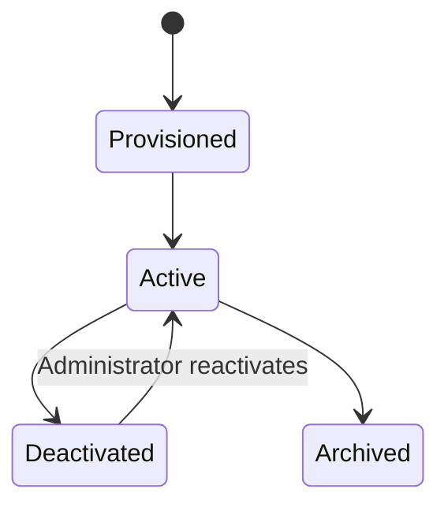

# Identity, Tenancy, and Authorization

## 1. Scope

This component defines who can access the platform, which institution they belong to, which roles
they hold, and how Grade / Grade–Subject enrollment determines every learner permission.

It governs access for:

- institution configuration and SourceCurriculum publication;
- active-period academic structure and enrollments;
- teacher assignments and class-insight access;
- StudentLearningDirectory material references, attempts, results, and evaluation snapshots;
- historical records after a period closes or archives;
- future AI retrieval that must reuse the same authorization checks.

Learner UX details live in
[Student learning experience](./01-student-learning-experience.md).

For the student-evaluation POC, active roles are administrator, teacher, and student. Parent and
supervisor roles are retained as future design extensions.

## 2. Decisions

| Decision | Choice | Rationale |
| --- | --- | --- |
| Account membership | One account belongs to exactly one institution | Keeps tenant boundaries simple and auditable for the POC. |
| Account creation | Administrator-provisioned | No self-signup in the POC; administrators provision student credentials. |
| Roles per user | Multiple explicitly scoped roles allowed | A person may teach multiple Grade–Subject offerings. |
| Student scope | Active Grade enrollment + active Grade–Subject enrollment | Both are required before material or quiz access. |
| Parent scope | Deferred from the student-evaluation POC | Parent dashboards follow after the core learner loop. |
| Supervisor scope | Deferred from the student-evaluation POC | Common materials and quizzes are administrator-published. |
| Historical access | Original scoped users retain read-only access | Preserves legitimate historical reference without expanding access. |
| Deactivation | Revoke all sessions immediately; retain records | Removes access promptly while preserving auditability. |
| Current authentication | Backend-managed email/password and access/refresh tokens | Fits the existing backend foundation. |
| Peer privacy | Students never see classmate identities or raw peer marks | Peer context is anonymized aggregate only. |

## 3. Identity model

```text
Institution
└── User account
    ├── Authentication credentials
    ├── Session and refresh-token records
    ├── Role assignments
    │   ├── Administrator
    │   ├── Teacher assignment scope
    │   └── Student Grade + Grade–Subject enrollment scope
    └── Audit history
```

Each account belongs to one institution. A student user account links to exactly one `Student`
profile record in the institution.

## 4. Roles and scopes

### 4.1 Administrator

An administrator has institution-wide management authority:

- create, activate, deactivate, and manage user accounts;
- create academic periods and mark one as active;
- create or copy SourceCurriculum Grade → Subject → Topic → Subtopic folders;
- manage grades, optional sections, students, CSV imports, Grade enrollments, and Grade–Subject
  enrollments;
- create teacher assignments;
- publish source materials and common mastery quizzes;
- configure institution defaults such as mastery/pass thresholds and result-release policy;
- access audit records within the institution.

### 4.2 Teacher

A teacher's access is granted through one or more teaching assignments:

```text
Teacher + Academic period + Grade–Subject offering (+ optional section)
```

The assignment authorizes the teacher to:

- view enrolled students covered by the assignment;
- view published SourceCurriculum materials for that Grade–Subject;
- view individual results and class aggregates for assigned students;
- view teacher-only comparison insights when assigned to both compared groups.

Teachers do not publish common SourceCurriculum materials in the POC.

### 4.3 Student

A student's access requires:

```text
Student + Academic period + Grade enrollment
Student + Academic period + Grade–Subject enrollment
```

Through those enrollments, the student may:

- open their private StudentLearningDirectory for the enrolled Grade–Subject;
- study published source materials for that offering;
- start and submit released common mastery quizzes;
- view own attempts, released results, and evaluation snapshots;
- view anonymized peer context for eligible common mastery quizzes.

A student may not:

- view another student's identity, answers, marks, or directory;
- access unpublished drafts or other Grade–Subject folders;
- modify enrollments, SourceCurriculum, or publication state.

### 4.4 Future roles

Parent/guardian and supervisor roles remain documented for later phases and do not gate the POC
evaluation loop.

## 5. Authorization decision model

Every protected request evaluates the following in order:

```text
1. Is the request authenticated?
2. Is the user active and session valid?
3. Does the resource belong to the user's institution?
4. Is the relevant academic period active, closed, or archived?
5. Does the user's role and explicit scope permit this action?
6. For learner resources: do active Grade and Grade–Subject enrollments apply?
7. Does the resource lifecycle state permit the action?
```

Example: a student opening subtopic material requires:

```text
active student
+ same institution
+ active academic period
+ active Grade enrollment
+ active Grade–Subject enrollment
+ published SourceMaterialVersion for that subtopic
```

Authorization occurs before database retrieval and before any AI context is assembled.
Client-supplied grade, subject, or student identifiers never grant access by themselves.

## 6. Permission matrix

| Capability | Administrator | Assigned teacher | Student |
| --- | --- | --- | --- |
| Manage accounts and enrollments | Yes | No | No |
| Manage periods and SourceCurriculum folders | Yes | Read assigned published sources | Read enrolled published sources |
| Publish source material / common quiz | Yes | No | No |
| Attempt released common quiz | No | No | Own Grade–Subject quizzes |
| View own / assigned results | Institution management only | Assigned group | Own results |
| View anonymized peer context | No | Assigned-group aggregates | Own anonymized peer band |
| View archived data | Institution records | Original assignment scope, read-only | Own historical directory, read-only |

## 7. Academic-period status rules

| Period status | Administrator | Teacher | Student |
| --- | --- | --- | --- |
| Planned | Configure data | Read setup only | No learner access |
| Active | Full configured authority | View assigned evidence | Study, attempt, view released results |
| Closed | Audited corrections only | Read-only except authorized correction | Read-only historical results |
| Archived | Read-only | Original scope read-only | Own history read-only |

## 8. Account lifecycle



When an administrator deactivates an account:

1. all access and refresh sessions are revoked immediately;
2. future authentication attempts are denied;
3. existing attempts, evaluation snapshots, and audit events remain intact;
4. the account is removed from new assignments.

## 9. AI authorization boundary

Future AI services must receive an authorization-filtered request context.

| Requester | AI may retrieve |
| --- | --- |
| Student | Published source material for enrolled Grade–Subject offerings; never other students' data |
| Teacher | Published sources and authorized aggregate metrics within active assignments |
| Administrator | Institution source and configuration data necessary for the requested management workflow |

The AI service may not:

- infer or bypass enrollment scope;
- retrieve another student's attempts, evaluation snapshots, or private directory;
- change scores, publish SourceCurriculum, or grant access;
- use archived-period data for a current-period request unless the user explicitly opens an
  authorized archived context.

## 10. Audit requirements

Record these events with actor, institution, period/scope, timestamp, request context, and result:

- account creation, activation, deactivation, and role/scope changes;
- login, refresh, logout, and session revocation;
- enrollment imports and corrections;
- SourceCurriculum publication and quiz release;
- quiz attempt start/submit/score, result release, and corrections;
- evaluation snapshot creation/versioning;
- denied authorization attempts for sensitive resources.

## 11. POC acceptance criteria

1. An administrator can provision administrator, teacher, and student accounts in one institution.
2. A student can access only published SourceCurriculum content and own released results for active
   Grade and Grade–Subject enrollments.
3. A student missing either enrollment cannot discover or open material or quizzes.
4. A teacher cannot access another teacher's assigned students, marks, or aggregates.
5. Deactivating an account revokes active sessions immediately and retains audit records.
6. Every content and future AI request applies the same institution, period, role, and enrollment
   restrictions as the API.

## 11a. Implementation spec: the scope resolver

Sections 1–11 describe *what* the boundary is. This section fixes *how* it is enforced, so that
the rule is written once and every feature inherits it.

### 11a.1 One resolver, no hand-written checks

`modules/authorization/scope.py` exposes a single function:

```text
scope_for(session, principal) -> Scope
```

`Scope` is the complete answer to "what may this principal read?" and is resolved **once per
request**, before a handler touches data. Features must not write their own role checks. Where a
`403` is currently raised inside a service function, it is replaced by a `Scope` consultation.

The rule to hold the codebase to: **grep for `HTTP_403_FORBIDDEN` should only find
`api/deps.py`.** Anything else is a permission rule that cannot be tested centrally.

### 11a.2 A teacher's reach is a set of pairs, not a grade or a subject

The single most consequential decision here. A teaching assignment is:

```text
(grade_subject_offering_id, section_id | NULL)
```

A NULL section covers every section of that offering. So a teacher of **Grade 8 Mathematics** and
**Grade 9 Science** may read Grade 9 Science students but **not** Grade 9 Mathematics students —
the same children, a different subject. Any implementation that narrows by grade alone, or by
subject alone, is wrong and will pass a naive test while failing rule T-03 below.

**The corollary, which is easy to miss.** Resolving *which students* a teacher reaches is only half
the boundary. `student_360` has one row per student **per subject**, so a read narrowed to a
teacher's student list still returns those students' other subjects. Meera reaches her Grade 8
Mathematics pupils — and a student-id filter hands her their Science, English, Arabic and Social
Studies marks along with them. **The filter has to match the grain of the data it filters:** pairs,
not students. Rule T-14.

**And the corollary to that.** Pairs may only widen a read when they come from a *teaching
assignment*. A student's enrolment produces the same shaped pairs, and filtering on those would
hand every student their whole class. `Scope` therefore keeps the two apart —
`taught_offering_sections` grants everyone in the pair, `enrolled_offering_sections` grants nobody
and exists only so the interface can list a student's subjects. A principal reaches a row by
exactly two routes: it is their own record, or they teach it. Rule T-15.

### 11a.3 Empty, never refused

When a principal asks about data outside their scope, the correct response is **zero rows**, not
`403` and not a message from the assistant declining. A refusal confirms that the requested data
exists, which is itself a disclosure. Concretely, `build_scope_clause` compiles an empty scope to
the predicate `1 = 0`.

`403` remains correct for *capability* failures — a student calling an administrator-only endpoint.
The distinction: **capability is refused, content is empty.**

### 11a.4 Auditable actions

Every event in section 10 is written through `modules/audit/service.py` and nothing else writes to
`audit_events`. In addition to that list, each **scoped read** records the resource, the row count
returned, and whether the caller was unrestricted.

A scoped read that returned `rows_returned = 0` is the most important entry in the trail: it is the
evidence that the boundary held, and it is what turns "we have role-based access" into something
demonstrable to a regulator or a parent.

### 11a.5 Test matrix

These are the tests behind the claim, implemented in `backend/tests/test_authorization_scope.py`.
Change this table first when a rule changes; the tests follow it.

| ID | Rule | Expected |
| --- | --- | --- |
| T-01 | Administrator scope | Unrestricted within their own institution, never beyond it |
| T-02 | Teacher scope shape | Resolves to (offering, section) pairs, not a grade |
| T-03 | Teacher, same grade, other subject | Refused — the case §11a.2 exists for |
| T-04 | Student scope | Exactly one student profile: their own |
| T-05 | Student reads a classmate | `allows_student` is false |
| T-06 | Teacher student set | Strictly between zero and the whole school |
| T-07 | Out-of-scope query | Zero rows, no error raised |
| T-08 | Student reads the register | Only their own rows come back |
| T-09 | Administrator vs teacher | Administrator strictly sees more |
| T-10 | Role but no assignments | Closed, not open — reaches nothing |
| T-11 | Empty scope predicate | Compiles to `1 = 0` |
| T-12 | Tenant isolation | Every clause pins `institution_id`, administrators included |
| T-13 | Row limiting | No single read can exceed the ceiling |
| T-14 | Teacher, subjects of their own pupils | Only the subjects they teach — §11a.2 corollary |
| T-15 | Student, subjects they are enrolled in | Still only their own rows, never a classmate's |

Still to be written, once the features they describe exist:

| ID | Rule | Blocked on |
| --- | --- | --- |
| T-16 | Deactivated account loses access immediately | account lifecycle wiring |
| T-17 | Student moved between sections mid-term | section-change workflow |
| T-18 | Closed period is read-only for teachers | period status enforcement |
| T-19 | Text-to-SQL cannot escape the scope predicate | text-to-SQL delivery; requirements in §11b |
| T-20 | Document search cannot return an unreleased document | task 2.4 |
| T-21 | A student cannot reach an unapproved quiz | task 3.7 |
| T-22 | Every AI answer path writes an audit event | task 2.6 |

### 11a.6 Dependency on the master register

Analytics reads go through the `student_360` view rather than ad-hoc joins, so the scope predicate
has one place to attach. The view therefore **must** carry `institution_id`, `student_id`,
`section_id`, `subject` and `grade`; without them the boundary cannot be applied to analytics at
all. This is asserted by a test rather than left to convention.

## 11b. Requirements: the generated-SQL guardrail

Covers task 2.3. **This section states what any text-to-SQL implementation must satisfy to
be acceptable under this policy. It does not describe a particular implementation, and it
is binding on whichever one ships.** These are review criteria, not a design proposal.

### 11b.1 The permission is applied to the query, never requested from the model

A generated query is **untrusted input that happens to look like code**. The boundary must
therefore not be expressed in anything the model controls — not in the prompt, and not in
the SQL the model returns.

Concretely: the scoping clause must be **added to the query after generation**, by platform
code. It must not be produced by the model in response to an instruction. A prompt is a
request that can be argued with; a post-generation rewrite cannot be. Any implementation in
which "only this teacher's students" arrives because the model was *asked* to include it
fails this requirement, however reliable it appears in testing.

It is fine — helpful, even — for the prompt to tell the model not to filter by institution
or teacher. That instruction exists to improve the SQL. It enforces nothing.

**R-1.** The row boundary is applied by rewriting the generated query. Prompt instructions
do not count as enforcement.

### 11b.2 One scope predicate for the whole platform

The permission rules live in `insights.service.scope_predicate`. Text-to-SQL must use that
function — compiled to SQL, or applied through it — rather than reimplementing the rules.

This is not a preference about code reuse. Two implementations of "who may read this
student" will drift, and the drift is not detectable by reading either one alone. The
platform has already shipped this bug once: a teacher's scope filtered which *students*
were visible but not which *subjects*, so a Grade 8 Mathematics teacher could read her
pupils' English marks (§11a.2). A second implementation is a second chance to make exactly
that mistake somewhere nobody is looking.

**R-2.** Row-level scoping calls `scope_predicate`. Changing the permission rules changes
every read path at once, including this one.

### 11b.3 Defence in depth, with at least one layer outside our own code

A single check that fails open loses the data. The following are the minimum:

| # | Requirement | Enforced by |
| --- | --- | --- |
| 1 | One statement, SELECT only, reading only permitted tables | a real SQL parser, not a regular expression |
| 2 | The caller's boundary applied by rewrite (R-1, R-2) | platform code |
| 3 | Row cap on every result | `LIMIT` |
| 4 | `SET TRANSACTION READ ONLY` + `statement_timeout` | **PostgreSQL** |
| 5 | Every question audited, including refused ones and ones returning nothing | `scoped()` |

**R-3.** Layer 4 is not optional, and matters most precisely because we do not write it. A
defect anywhere in layers 1–3 must still be unable to produce a write.

Layer 1 must use a parser. `DELETE` hidden inside a string literal or a comment is exactly
what pattern-matching gets wrong.

### 11b.4 Table scoping must survive schema qualification

If the boundary is applied by rebinding a table name — a CTE that shadows the real table,
say — then **schema-qualified names must be rejected outright**. `public.student_360`
resolves past a CTE to the unscoped table, and is the one escape that reliably works.

Two related traps, recorded because they are easy to get wrong and produce a query that
looks correct:

- A shadowing CTE must be **prepended**, not appended. PostgreSQL resolves a CTE against
  those declared before it, so an appended one can be read around by a model-defined CTE.
- In sqlglot specifically, `.with_(append=False)` *discards* existing CTEs rather than
  prepending, producing a query that references names that no longer exist.

### 11b.5 Empty, not refused — the rule holds here too

A teacher asking about a grade they do not teach gets an empty result set and HTTP 200,
consistent with §11a.3. This should need no special case: the boundary simply matches no
rows. An aggregate over nothing legitimately returns `0`.

A refusal is reserved for a malformed or forbidden *query* — a write attempt, an
out-of-scope table — never for data being out of scope.

**R-4.** "Not allowed to ask that" and "nothing to show" stay distinguishable in the
response and in the audit trail, and neither reveals whether the data exists.

### 11b.6 Column-level restrictions

Row scoping alone does not protect a column that nobody should read at any level.
Password hashes, answer keys and similar must be unreadable **regardless of role,
administrators included**.

**R-5.** A column blocklist applies independently of the row boundary, and is not
satisfied by role checks.

### 11b.7 Known limits to record, whatever ships

- If the table allowlist is enforced by our own parser, a parsing discrepancy is the most
  likely route to reading an unintended table, and layer 4 does not defend against it —
  that layer stops writes, not reads. **Hardening beyond POC:** run generated SQL as a
  dedicated PostgreSQL role granted `SELECT` on the permitted objects and nothing else,
  which moves the allowlist into the database where the parser cannot be the weak point.
- The model should not be shown the caller's identity, so its SQL cannot be tailored to
  the boundary. The cost is that it cannot explain *why* a result is empty; that
  explanation is the interface's job, not the model's.

## 12. Deferred scope

- Self-signup and unsupervised invitation workflows
- Password reset beyond administrator reset
- External identity providers, SSO, OAuth, and SCIM
- Multi-institution accounts
- Parent, supervisor, and TPO roles as active POC gates
- Multifactor authentication

Parent access is designed for but not built: a parent is "a student's scope, granted to a second
person," so it adds no new shape to the resolver. It is excluded from the POC because consent and
data-protection handling would consume time the schedule does not have before the sponsor
presentation, not because the model cannot express it.

## 13. Open decisions

- What password policy and password-reset method should the institution require?
- Should administrators be able to view all historical student marks, or only administrative audit
  records in the POC?
- Retention: how long are audit events kept, and who may delete them? Nobody can today, which is
  the safe default but not a decision anyone has taken deliberately.
