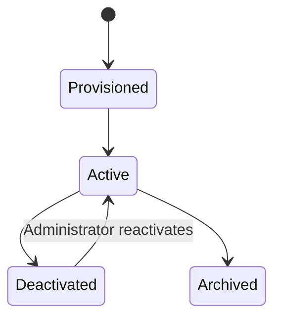

# Identity, Tenancy, and Authorization

## 1. Scope

This component defines who can access the platform, which institution they belong to, which roles
they hold, and how Grade / Grade–Subject enrollment determines every learner permission.

It governs access for:

- institution configuration and SourceCurriculum publication;
- active-period academic structure and enrollments;
- teacher assignments and class-insight access;
- StudentLearningDirectory material references, attempts, results, and evaluation snapshots;
- historical records after a period closes or archives;
- future AI retrieval that must reuse the same authorization checks.

Learner UX details live in
[Student learning experience](./01-student-learning-experience.md).

For the student-evaluation POC, active roles are administrator, teacher, and student. Parent and
supervisor roles are retained as future design extensions.

## 2. Decisions

| Decision | Choice | Rationale |
| --- | --- | --- |
| Account membership | One account belongs to exactly one institution | Keeps tenant boundaries simple and auditable for the POC. |
| Account creation | Administrator-provisioned | No self-signup in the POC; administrators provision student credentials. |
| Roles per user | Multiple explicitly scoped roles allowed | A person may teach multiple Grade–Subject offerings. |
| Student scope | Active Grade enrollment + active Grade–Subject enrollment | Both are required before material or quiz access. |
| Parent scope | Deferred from the student-evaluation POC | Parent dashboards follow after the core learner loop. |
| Supervisor scope | Deferred from the student-evaluation POC | Common materials and quizzes are administrator-published. |
| Historical access | Original scoped users retain read-only access | Preserves legitimate historical reference without expanding access. |
| Deactivation | Revoke all sessions immediately; retain records | Removes access promptly while preserving auditability. |
| Current authentication | Backend-managed email/password and access/refresh tokens | Fits the existing backend foundation. |
| Peer privacy | Students never see classmate identities or raw peer marks | Peer context is anonymized aggregate only. |

## 3. Identity model

```text
Institution
└── User account
    ├── Authentication credentials
    ├── Session and refresh-token records
    ├── Role assignments
    │   ├── Administrator
    │   ├── Teacher assignment scope
    │   └── Student Grade + Grade–Subject enrollment scope
    └── Audit history
```

Each account belongs to one institution. A student user account links to exactly one `Student`
profile record in the institution.

## 4. Roles and scopes

### 4.1 Administrator

An administrator has institution-wide management authority:

- create, activate, deactivate, and manage user accounts;
- create academic periods and mark one as active;
- create or copy SourceCurriculum Grade → Subject → Topic → Subtopic folders;
- manage grades, optional sections, students, CSV imports, Grade enrollments, and Grade–Subject
  enrollments;
- create teacher assignments;
- publish source materials and common mastery quizzes;
- configure institution defaults such as mastery/pass thresholds and result-release policy;
- access audit records within the institution.

### 4.2 Teacher

A teacher's access is granted through one or more teaching assignments:

```text
Teacher + Academic period + Grade–Subject offering (+ optional section)
```

The assignment authorizes the teacher to:

- view enrolled students covered by the assignment;
- view published SourceCurriculum materials for that Grade–Subject;
- view individual results and class aggregates for assigned students;
- view teacher-only comparison insights when assigned to both compared groups.

Teachers do not publish common SourceCurriculum materials in the POC.

### 4.3 Student

A student's access requires:

```text
Student + Academic period + Grade enrollment
Student + Academic period + Grade–Subject enrollment
```

Through those enrollments, the student may:

- open their private StudentLearningDirectory for the enrolled Grade–Subject;
- study published source materials for that offering;
- start and submit released common mastery quizzes;
- view own attempts, released results, and evaluation snapshots;
- view anonymized peer context for eligible common mastery quizzes.

A student may not:

- view another student's identity, answers, marks, or directory;
- access unpublished drafts or other Grade–Subject folders;
- modify enrollments, SourceCurriculum, or publication state.

### 4.4 Future roles

Parent/guardian and supervisor roles remain documented for later phases and do not gate the POC
evaluation loop.

## 5. Authorization decision model

Every protected request evaluates the following in order:

```text
1. Is the request authenticated?
2. Is the user active and session valid?
3. Does the resource belong to the user's institution?
4. Is the relevant academic period active, closed, or archived?
5. Does the user's role and explicit scope permit this action?
6. For learner resources: do active Grade and Grade–Subject enrollments apply?
7. Does the resource lifecycle state permit the action?
```

Example: a student opening subtopic material requires:

```text
active student
+ same institution
+ active academic period
+ active Grade enrollment
+ active Grade–Subject enrollment
+ published SourceMaterialVersion for that subtopic
```

Authorization occurs before database retrieval and before any AI context is assembled.
Client-supplied grade, subject, or student identifiers never grant access by themselves.

## 6. Permission matrix

| Capability | Administrator | Assigned teacher | Student |
| --- | --- | --- | --- |
| Manage accounts and enrollments | Yes | No | No |
| Manage periods and SourceCurriculum folders | Yes | Read assigned published sources | Read enrolled published sources |
| Publish source material / common quiz | Yes | No | No |
| Attempt released common quiz | No | No | Own Grade–Subject quizzes |
| View own / assigned results | Institution management only | Assigned group | Own results |
| View anonymized peer context | No | Assigned-group aggregates | Own anonymized peer band |
| View archived data | Institution records | Original assignment scope, read-only | Own historical directory, read-only |

## 7. Academic-period status rules

| Period status | Administrator | Teacher | Student |
| --- | --- | --- | --- |
| Planned | Configure data | Read setup only | No learner access |
| Active | Full configured authority | View assigned evidence | Study, attempt, view released results |
| Closed | Audited corrections only | Read-only except authorized correction | Read-only historical results |
| Archived | Read-only | Original scope read-only | Own history read-only |

## 8. Account lifecycle



When an administrator deactivates an account:

1. all access and refresh sessions are revoked immediately;
2. future authentication attempts are denied;
3. existing attempts, evaluation snapshots, and audit events remain intact;
4. the account is removed from new assignments.

## 9. AI authorization boundary

Future AI services must receive an authorization-filtered request context.

| Requester | AI may retrieve |
| --- | --- |
| Student | Published source material for enrolled Grade–Subject offerings; never other students' data |
| Teacher | Published sources and authorized aggregate metrics within active assignments |
| Administrator | Institution source and configuration data necessary for the requested management workflow |

The AI service may not:

- infer or bypass enrollment scope;
- retrieve another student's attempts, evaluation snapshots, or private directory;
- change scores, publish SourceCurriculum, or grant access;
- use archived-period data for a current-period request unless the user explicitly opens an
  authorized archived context.

## 10. Audit requirements

Record these events with actor, institution, period/scope, timestamp, request context, and result:

- account creation, activation, deactivation, and role/scope changes;
- login, refresh, logout, and session revocation;
- enrollment imports and corrections;
- SourceCurriculum publication and quiz release;
- quiz attempt start/submit/score, result release, and corrections;
- evaluation snapshot creation/versioning;
- denied authorization attempts for sensitive resources.

## 11. POC acceptance criteria

1. An administrator can provision administrator, teacher, and student accounts in one institution.
2. A student can access only published SourceCurriculum content and own released results for active
   Grade and Grade–Subject enrollments.
3. A student missing either enrollment cannot discover or open material or quizzes.
4. A teacher cannot access another teacher's assigned students, marks, or aggregates.
5. Deactivating an account revokes active sessions immediately and retains audit records.
6. Every content and future AI request applies the same institution, period, role, and enrollment
   restrictions as the API.

## 12. Deferred scope

- Self-signup and unsupervised invitation workflows
- Password reset beyond administrator reset
- External identity providers, SSO, OAuth, and SCIM
- Multi-institution accounts
- Parent, supervisor, and TPO roles as active POC gates
- Multifactor authentication

## 13. Open decisions

- What password policy and password-reset method should the institution require?
- Should administrators be able to view all historical student marks, or only administrative audit
  records in the POC?
