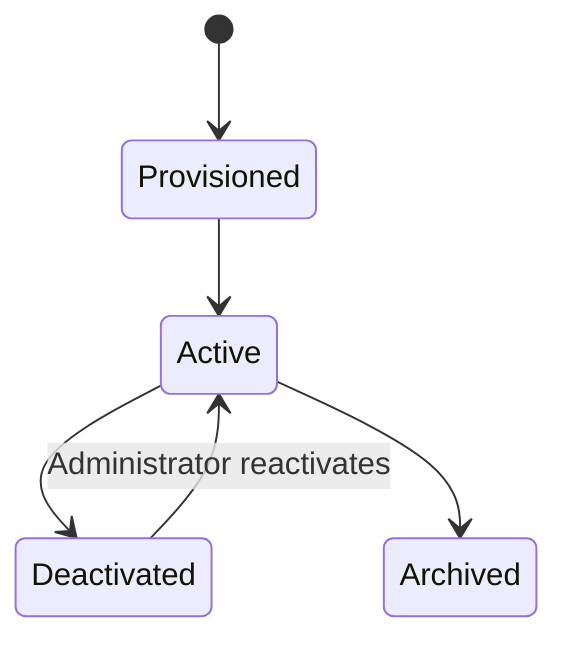

# Identity, Tenancy, and Authorization

## 1. Scope

This component defines who can access the platform, which institution they belong to, which roles
they hold, and how their academic-period scope determines every permission.

It governs access for:

- institution configuration and baseline publication;
- active-period academic structure, enrollment, and timetable data;
- teacher workspaces, student records, marks, materials, and quiz variants;
- supervisor review batches and urgent submissions;
- historical records after a period closes or archives;
- AI retrieval, generation, analytics, and draft-action requests.

## 2. Decisions

| Decision | Choice | Rationale |
| --- | --- | --- |
| Account membership | One account belongs to exactly one institution | Keeps tenant boundaries simple and auditable for the POC. |
| Account creation | Administrator-provisioned | No self-signup or invitation workflow in the POC. |
| Roles per user | Multiple explicitly scoped roles allowed | A person may teach and supervise different academic scopes. |
| Supervisor scope | Grade + academic period across all subjects | Matches grade-level supervisory responsibility. |
| Historical access | Original scoped users retain read-only access | Preserves legitimate historical reference without expanding access. |
| Deactivation | Revoke all sessions immediately; retain records | Removes access promptly while preserving auditability. |
| Current authentication | Backend-managed email/password and access/refresh tokens | Fits the existing backend foundation and avoids external identity-provider dependency. |

## 3. Identity model

```text
Institution
└── User account
    ├── Authentication credentials
    ├── Session and refresh-token records
    ├── Role assignments
    │   ├── Administrator
    │   ├── Teacher assignment scope
    │   └── Supervisor grade scope
    └── Audit history
```

Each account belongs to one institution. A user cannot switch to another institution or use a role
from another institution in the POC.

## 4. Roles and scopes

### 4.1 Administrator

An administrator has institution-wide management authority:

- create, activate, deactivate, and manage user accounts;
- create academic periods and mark one as active;
- create or copy curriculum templates;
- manage grades, sections, students, and CSV imports;
- create teacher assignments, supervisor grade assignments, and timetables;
- publish institution baseline materials and master plans;
- configure institution defaults such as mastery/pass thresholds;
- access audit records within the institution.

Administrators do not receive a teacher comparison dashboard through the analytics POC component.

### 4.2 Teacher

A teacher's access is granted through one or more teaching assignments:

```text
Teacher + Academic period + Grade–Subject offering + Section
```

The assignment authorizes the teacher to:

- view the relevant Grade–Subject workspace and assigned section;
- view students enrolled in that assigned section;
- access timetable occurrences for that assignment;
- track published baseline material;
- create private drafts, section plan adaptations, question drafts, and section quiz variants;
- submit standard or urgent review items;
- enter marks for approved delivered variants;
- view teacher-only comparison insights when assigned to both compared sections.

### 4.3 Supervisor

A supervisor is assigned to one or more Grade–Academic Period scopes:

```text
Supervisor + Academic period + Grade
```

The supervisor can review teacher material and plan batches for every subject and section within
that grade. They can:

- view batch summaries and the underlying submitted artifacts;
- approve, request changes, reject, or defer individual items;
- approve urgent items;
- approve scoped mastery-threshold overrides;
- view source references, plan alignment, and non-student-specific batch risk flags.

In the POC, supervisors cannot view student marks or assessment comparison dashboards.

### 4.4 Multiple roles

A user may combine roles, with each role evaluated independently. For example:

```text
Maya Shah
├── Teacher: 2026–27, Grade 8 Mathematics, Grade 8-A
├── Teacher: 2026–27, Grade 8 Mathematics, Grade 8-B
└── Supervisor: 2026–27, Grade 9
```

Maya can review Grade 9 batches but cannot review Grade 8 teacher work merely because she teaches
Grade 8.

## 5. Authorization decision model

Every protected request evaluates the following in order:

```text
1. Is the request authenticated?
2. Is the user active and session valid?
3. Does the resource belong to the user's institution?
4. Is the relevant academic period active, closed, or archived?
5. Does the user's role and explicit scope permit this action?
6. Does the resource lifecycle state permit the action?
```

Example: approving a teacher artifact requires:

```text
active supervisor
+ same institution
+ matching academic period
+ matching Grade
+ submitted artifact version
+ review action permitted by lifecycle state
```

Authorization occurs before database retrieval and before any AI context is assembled.

## 6. Permission matrix

| Capability | Administrator | Assigned teacher | Grade supervisor |
| --- | --- | --- | --- |
| Manage accounts | Yes | No | No |
| Manage periods, students, assignments, timetable | Yes | Read assigned data | No |
| Publish institution baseline | Yes | No | No |
| View published baseline | Yes | Assigned scope | Assigned Grade scope |
| Create teacher draft | No | Assigned scope | No |
| Submit review batch | No | Own drafts | No |
| Review submitted batch item | No | No | Assigned Grade scope |
| Approve urgent item | No | No | Assigned Grade scope |
| Enter marks | No | Assigned section | No |
| View section comparison | No | Only sections taught by same teacher | No |
| View student marks | Institution management only | Assigned section | No |
| View archived data | Institution records | Original assignment scope, read-only | Original Grade scope, read-only |

## 7. Academic-period status rules

| Period status | Administrator | Teacher | Supervisor |
| --- | --- | --- | --- |
| Planned | Configure data | Create private drafts only | Review scope setup only |
| Active | Full configured authority | Create drafts, submit items, use approved material, enter marks | Review submitted/urgent items |
| Closed | Audited corrections only | Read-only except authorized correction workflow | Read-only except authorized correction workflow |
| Archived | Read-only | Original scope read-only | Original scope read-only |

## 8. Account lifecycle



### Provisioned

An administrator creates the account with the user identity, role assignments, and initial
credentials. The account has no access until it is active.

### Active

The user can authenticate and exercise only the permissions granted by current role scopes and
resource states.

### Deactivated

When an administrator deactivates an account:

1. all access and refresh sessions are revoked immediately;
2. future authentication attempts are denied;
3. existing authored records, approvals, marks, and audit events remain intact;
4. the account is removed from new assignments and review routing;
5. historical records retain the original author/reviewer identity.

### Archived

Account archival is a retention-state operation used after institutional policy permits removal
from normal administration views. It does not erase audit history without a separate retention
policy.

## 9. AI authorization boundary

The AI service receives an authorization-filtered request context, never broad institutional data.

| Requester | AI may retrieve |
| --- | --- |
| Teacher | Published institution sources and teacher-owned/approved artifacts within active assignments; authorized aggregate metrics for those sections |
| Supervisor | Submitted batch artifacts, their linked baselines, and non-student-specific batch metrics within assigned Grade scope |
| Administrator | Institution baseline and configuration data necessary for the requested management workflow |

The AI service may not:

- infer or bypass role scope;
- retrieve student marks outside the teacher's assigned section;
- reveal section comparison insights to supervisors;
- act as an approver or activate a draft;
- use archived-period data for a current-period request unless the user explicitly opens the
  authorized archived context.

## 10. Audit requirements

Record these events with actor, institution, period/scope, timestamp, request context, and result:

- account creation, activation, deactivation, and role/scope changes;
- login, refresh, logout, and session revocation;
- administrator data imports and corrections;
- baseline publication;
- teacher draft creation and batch submission;
- supervisor review decisions;
- mark entry and corrections;
- analytics calculation/version and AI recommendation creation;
- denied authorization attempts for sensitive resources.

## 11. POC acceptance criteria

1. An administrator can provision a user account in one institution with one or more role scopes.
2. One user can hold teacher and supervisor roles without gaining unscoped permissions.
3. A teacher cannot access another teacher's section, students, marks, materials, or variants.
4. A supervisor can review only submitted work for their assigned Grade in the active period.
5. A supervisor cannot view student marks or section comparison insights.
6. Archived-period users retain read-only access only to their original assignments/scopes.
7. Deactivating an account revokes active sessions immediately and retains audit records.
8. Every AI request applies the same institution, period, role, and scope restrictions as the API.

## 12. Deferred scope

- Self-signup, invitations, and email-verification workflows
- Password reset and account recovery
- External identity providers, SSO, OAuth, and SCIM
- Multi-institution accounts
- Parent, student, and TPO roles
- Fine-grained delegated administration
- Time-limited or substitute access grants
- Device management and multifactor authentication

## 13. Open decisions

- What password policy and password-reset method should the institution require?
- Should administrators be able to view all historical student marks, or only administrative audit
  records in the POC?
- Is a supervisor Grade scope assigned for the full period or a date range within a period?
