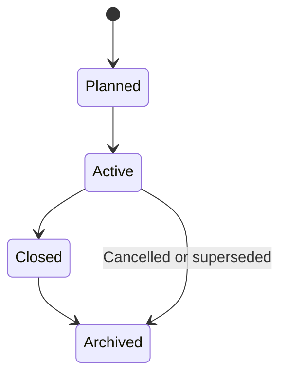
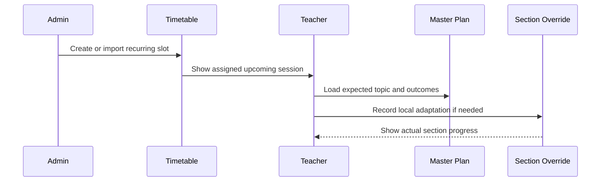

# Academic Structure, Enrollment, and Timetable

## 1. Scope

This component defines the institution-owned academic data that powers teacher workspaces,
curriculum planning, assessments, marks, and analytics.

It is the source of truth for:

- multiple academic periods;
- grades, sections, subjects, topics, and learning outcomes;
- fixed student section membership within a period;
- teacher teaching assignments;
- recurring timetable slots and dated exceptions;
- CSV imports and administrator corrections.

## 2. Decisions

| Decision | Choice | Rationale |
| --- | --- | --- |
| Academic periods | Multiple first-class periods; one active period per institution | Historical records remain valid while teacher navigation and operations have one clear current context. |
| Curriculum setup | Administrator-created or copied template | Teachers plan and assess from a common approved curriculum structure. |
| Student creation | CSV import plus manual correction | Efficient initial setup without blocking small fixes. |
| Student section transfer | Not supported in the POC | Keeps enrollment, marks, and comparisons unambiguous. |
| Timetable setup | Administrator manual entry plus CSV import | Supports quick POC setup and existing spreadsheet workflows. |
| Timetable changes | Recurring slots plus dated exceptions | Models real schedules without duplicating every session manually. |
| Institution closures | Administrator-created closure dates | Keeps the POC self-contained and generates timetable exceptions consistently. |
| Co-teaching | Not supported | One timetable slot has one teacher through one teaching assignment. |

## 3. Core hierarchy

```text
Institution
├── Academic period
│   ├── Curriculum template
│   │   └── Grade–Subject
│   │       └── Topic
│   │           └── Learning outcome
│   ├── Grade
│   │   └── Section
│   │       └── Student enrollment
│   ├── Teaching assignment
│   │   └── Teacher + Grade–Subject + Section
│   └── Timetable
│       └── Recurring slot + dated exceptions
└── Users
```

An academic period is the container for all operational academic records. A Grade 8-A section in
2026–27 is distinct from Grade 8-A in 2027–28, even if the same students or teacher continue.
The POC permits one active period per institution at a time; other periods are planned, closed, or
archived.

## 4. Entity model

| Entity | Key fields | Notes |
| --- | --- | --- |
| Institution | id, name, timezone | Tenant boundary for all records. |
| Academic period | institution, name, start date, end date, status | Supports planned, active, archived, and closed periods. |
| Grade | institution, name, order | Reusable reference such as Grade 8. |
| Period grade | academic period, grade | Enables an institution to offer a grade only in selected periods. |
| Section | period grade, name | A period-specific group such as Grade 8-A. |
| Subject | institution, name, code | Reusable academic discipline such as Mathematics. |
| Grade–Subject offering | academic period, grade, subject | The curriculum and planning context. |
| Topic | Grade–Subject offering, name, sequence | A teachable unit, such as Linear Equations. |
| Learning outcome | topic, statement, code, sequence | A measurable expectation used by plans and questions. |
| Student | institution, identifier, name, status | Student identity independent of a particular period. |
| Student enrollment | student, academic period, section, status | One active section per student per period in the POC. |
| Teaching assignment | teacher, academic period, Grade–Subject offering, section | Authorizes teacher workspace, marks, and timetable access. |
| Supervisor grade assignment | supervisor, academic period, period grade | Authorizes review of teacher batches and urgent items across every subject in one grade. |
| Timetable slot | teaching assignment, weekday, start/end time, room | Recurring expected teaching time. |
| Timetable exception | timetable slot, date, type, replacement data | Cancellation, reschedule, holiday, or room change. |
| Master plan session | offering, topic, planned date/week, outcomes | Shared expected pace. |
| Section session override | master plan session, section, actual data | Teacher-recorded local adaptation. |

## 5. Academic-period lifecycle



### Planned

Administrators can create the curriculum template, sections, students, assignments, and timetable.
Teachers may prepare drafts but cannot record teaching progress or marks yet. Only one period may
be activated for the institution at a time.

### Active

The period appears by default in teacher workspaces. Teachers can draft plans and materials, teach
with approved content, administer approved quizzes, and enter marks for their assigned sections.

### Closed

No new normal teaching or assessment records are created. Authorized corrections require an audit
reason.

### Archived

The period is retained for reference and analytics but is read-only by default.

## 6. Curriculum template setup

Administrators establish the Grade–Subject offering for each period by either:

1. creating a new template; or
2. copying a prior period's approved template.

Copying creates new period-scoped records. It does not share mutable topics, learning outcomes,
master plans, question corpora, or blueprints across periods.

```text
2025–26 Grade 8 Mathematics template
    -> copy
2026–27 Grade 8 Mathematics template
```

Teachers use the created structure but do not modify shared topic or learning-outcome definitions
in the POC. They may create plans and materials attached to those definitions.

## 7. Student enrollment

### 7.1 POC model

Each student has one active section enrollment per academic period.

```text
Student: Asha Patel
Academic period: 2026–27
Section: Grade 8-A
Status: active
```

The POC does not support moving a student between Grade 8-A and Grade 8-B during the period. If an
institution requires that transfer, an administrator must resolve it outside the POC before
creating assessment or attendance records for the student.

### 7.2 CSV import

Administrators import students with a CSV that includes, at minimum:

```text
student_identifier, full_name, grade, section
```

The import flow must:

1. validate headers, required values, duplicates, Grade/Section existence, and identifier format;
2. show a preview of accepted rows, warnings, and rejected rows;
3. require administrator confirmation before persisting changes;
4. create an import audit record with the original file and row-level outcome;
5. allow manual correction of individual student and enrollment records afterward.

An import must not silently overwrite an existing enrollment.

## 8. Teaching assignments

A teaching assignment is the central authorization and scheduling link:

```text
Teacher + Academic period + Grade–Subject offering + Section
```

Example:

```text
Teacher: Maya Shah
Period: 2026–27
Offering: Grade 8 Mathematics
Section: Grade 8-A
```

The same teacher receives separate assignments for Grade 8-A and Grade 8-B. The teacher workspace
groups these assignments into one Grade 8 Mathematics common workspace while preserving
section-specific boundaries.

An assignment determines whether a teacher can:

- see a timetable slot;
- open a section workspace;
- view enrolled students;
- create section quiz variants;
- enter or view marks;
- record a session override;
- receive comparison insights for their own assigned sections.

## 9. Timetable model

### 9.1 Recurring slot

A recurring slot represents the usual schedule:

```text
Teaching assignment: Grade 8-A Mathematics
Weekday: Monday
Start: 09:00
End: 09:45
Room: B-12
```

A slot can link to a master-plan session when the date or week is known. The timetable does not
assume a recurring slot always maps to the same topic. Each slot has exactly one teacher in the
POC; co-teaching and substitute workflows are deferred.

### 9.2 Dated exception

Exceptions override one occurrence without altering the recurring schedule:

| Exception type | Example |
| --- | --- |
| Cancelled | School holiday or teacher absence |
| Rescheduled | Monday session moved to Wednesday |
| Updated | Room or duration changes |

Institution-wide holidays and closures are entered by an administrator as dated closure records.
The scheduling service derives a cancellation exception for every affected timetable occurrence.
Administrators do not need to edit each class separately.

### 9.3 Manual creation

An administrator selects teaching assignment, weekday, start/end time, room, and effective date
range. The system rejects overlapping slots for the same teacher or section unless the
administrator explicitly resolves the conflict.

### 9.4 CSV import

The timetable CSV should include:

```text
teacher_identifier, grade, section, subject, weekday, start_time, end_time, room, effective_from, effective_to
```

The import preview must detect unknown teachers, missing assignments, invalid weekday/time formats,
and teacher/section schedule conflicts before saving.

## 10. Timetable-to-plan flow



## 11. Authorization and data integrity

- Only institution administrators manage periods, curriculum templates, sections, student
  enrollments, teaching assignments, and timetable source data.
- Teachers read only their active assignments and their assigned students.
- Teachers cannot change section membership, curriculum topic definitions, or another teacher's
  timetable.
- Every import, enrollment edit, assignment edit, timetable change, and post-close correction is
  audited.
- Database constraints should enforce one active enrollment per student per academic period in the
  POC.
- Database constraints should enforce unique teaching assignments and prevent timetable overlap
  unless an authorized exception exists.
- Database constraints should enforce one teacher assignment per timetable slot.

## 12. POC acceptance criteria

1. An administrator can create multiple academic periods and select exactly one as active.
2. An administrator can copy a prior Grade–Subject curriculum template into a new period.
3. An administrator can create Grade 8-A and Grade 8-B sections within one period.
4. An administrator can import students through a validated CSV and correct individual records.
5. A student has only one active section enrollment in one period.
6. An administrator can create teaching assignments for a teacher across multiple sections.
7. An administrator can create or import recurring timetable slots and receive conflict warnings.
8. A teacher sees only timetable slots and students from their assignments.
9. A closed or archived period prevents ordinary edits while retaining historical access.

## 13. Deferred scope

- Effective-dated student transfers between sections
- Parent and guardian records
- Student self-service account provisioning
- External student-information-system synchronization
- Direct third-party timetable integration
- Attendance management
- Substitute-teacher workflows
- Co-teaching
- Campus, department, program, and room-allocation hierarchy

## 14. Open decisions

- Does a teacher need a self-managed availability view in addition to the institutional timetable?
- Should a master-plan session attach to a timetable occurrence, or only to a week/date range?
