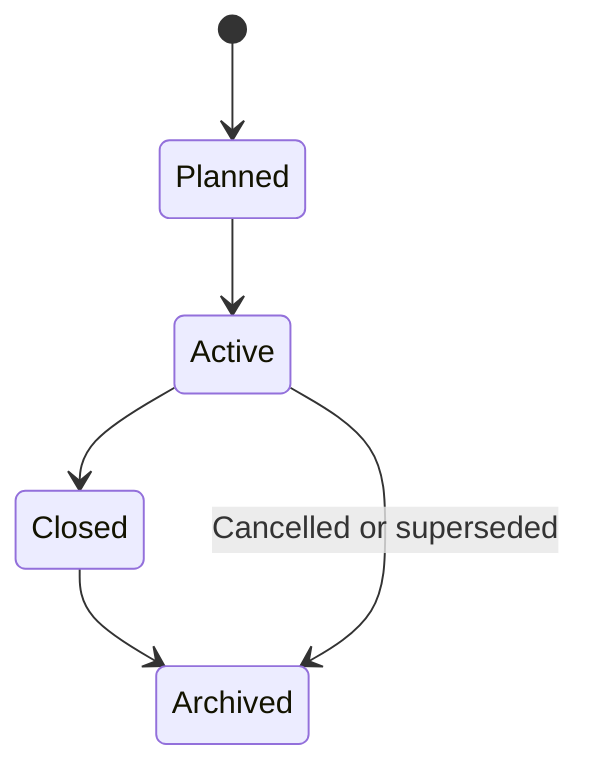

# Academic Structure, Enrollment, and Timetable

## 1. Scope

This component defines the institution-owned academic data that powers the SourceCurriculum folder
hierarchy, student learning access, common mastery quizzes, and evaluation analytics.

It is the source of truth for:

- multiple academic periods;
- grades, subjects, topics, and subtopics;
- student Grade enrollment and Grade–Subject enrollment;
- optional sections used only for teacher/reporting grouping in the POC;
- teacher teaching assignments;
- CSV imports and administrator corrections;
- timetable records retained for later teaching workflows.

Learner-facing presentation is defined in
[Student learning experience](./01-student-learning-experience.md).
Source publication is defined in
[Material lifecycle](./04-material-lifecycle-and-ai-artifacts.md).

The student-evaluation POC uses enrollment to deliver administrator-published common materials and
common subtopic quizzes. Parent links, teacher-authored learner content, and adaptive personalization
are deferred.

## 2. Decisions

| Decision | Choice | Rationale |
| --- | --- | --- |
| Academic periods | Multiple first-class periods; one active period per institution | Historical records remain valid while operations have one clear current context. |
| Curriculum setup | Administrator-created or copied Grade–Subject folder template | Teachers and students work from a common approved structure. |
| Learner content scope | Active Grade enrollment + active Grade–Subject enrollment | Authorization is enrollment-first, not ad-hoc collection grants. |
| Common rollout | Same published material and quiz for every student in a Grade–Subject | Matches the reusable admin rollout model. |
| Sections | Optional teacher/reporting grouping only | Sections do not change material or quiz assignment in the POC. |
| Student section transfer | Not supported in the POC | Keeps enrollments and comparisons unambiguous. |
| Parent links | Deferred | First release has no parent portal. |
| Timetable | Retained for later teacher workflows; not required for material/quiz access | Keeps evaluation POC unblocked. |

## 3. Core hierarchy

```text
Institution
├── Academic period
│   ├── SourceCurriculum
│   │   └── Grade
│   │       └── Subject
│   │           └── Topic
│   │               └── Subtopic
│   │                   ├── SourceMaterialVersions
│   │                   └── CommonMasteryQuiz
│   ├── Grade
│   │   ├── StudentGradeEnrollment
│   │   └── Section (optional reporting group)
│   ├── StudentSubjectEnrollment
│   │   └── Student + Academic period + Grade–Subject
│   └── Teaching assignment
│       └── Teacher + Grade–Subject (+ optional section)
└── Users
    └── Student profile + optional user account
```

An academic period is the container for operational academic records. Grade 8 Mathematics in
2026–27 is distinct from Grade 8 Mathematics in 2027–28.

## 4. Entity model

| Entity | Key fields | Notes |
| --- | --- | --- |
| Institution | id, name, timezone | Tenant boundary for all records. |
| Academic period | institution, name, start date, end date, status | planned, active, closed, archived. |
| Grade | institution, name, order | Reusable reference such as Grade 8. |
| Period grade | academic period, grade | Grade offered in a period. |
| Section | period grade, name | Optional reporting group such as Grade 8-A. |
| Subject | institution, name, code | Reusable discipline such as Mathematics. |
| Grade–Subject offering | academic period, grade, subject | Curriculum and enrollment context. |
| Topic | Grade–Subject offering, name, sequence | Teachable unit such as Algebra. |
| Subtopic | topic, name, sequence | Unit such as Linear Equations; owns material and quiz. |
| Learning outcome | subtopic, statement, code, sequence | Measurable expectation used by questions and struggle analysis. |
| Student | institution, identifier, name, status, user_account_id | Identity independent of a particular period. |
| StudentGradeEnrollment | student, academic period, grade, status | Required before any learner access. |
| StudentSubjectEnrollment | student, academic period, Grade–Subject offering, status | Required before material/quiz access for that subject. |
| Teaching assignment | teacher, academic period, Grade–Subject offering, optional section | Authorizes teacher class insights. |

## 5. Academic-period lifecycle



### Planned

Administrators can create the SourceCurriculum folders, enrollments, and teaching assignments.
Students do not yet receive learner access. Only one period may be activated at a time.

### Active

Enrolled students can open their StudentLearningDirectory for published Grade–Subject content and
released quizzes. Teachers can view assigned-group evidence.

### Closed / Archived

No new normal enrollments, publications for teaching, or quiz attempts. Historical read-only access
is retained for authorized original scopes.

## 6. Curriculum folder setup

Administrators establish the Grade–Subject offering for each period by either:

1. creating a new Topic/Subtopic template; or
2. copying a prior period's approved template as new period-scoped records.

Copying does not share mutable topics, subtopics, materials, or quizzes across periods.

```text
2025–26 Grade 8 Mathematics template
    -> copy
2026–27 Grade 8 Mathematics template
```

## 7. Student enrollment and learner access

### 7.1 Required enrollments

A student needs both enrollments in the active period:

```text
StudentGradeEnrollment: Asha Patel / 2026–27 / Grade 8 / active
StudentSubjectEnrollment: Asha Patel / 2026–27 / Grade 8 Mathematics / active
```

Through those enrollments, the student inherits access to:

1. published SourceMaterialVersions under Grade 8 Mathematics topics/subtopics;
2. released CommonMasteryQuiz versions for those subtopics;
3. a private StudentLearningDirectory containing progress, attempts, and evaluation snapshots.

Authorization formula:

```text
active institution
+ active academic period
+ active StudentGradeEnrollment
+ active StudentSubjectEnrollment
+ published source/quiz version
```

Sections do not expand or restrict common material access in the POC.

### 7.2 Student account provisioning

Administrators may:

1. import or create student profile records;
2. provision a linked student user account;
3. create Grade and Grade–Subject enrollments;
4. activate the account for learner access only when both enrollments exist for the active or
   planned period that will become active.

### 7.3 CSV import

Minimum CSV for rostering:

```text
student_identifier, full_name, grade, subject
```

Optional columns:

```text
section, email, provision_login
```

The import flow must validate headers, duplicates, Grade/Subject existence, show a preview, require
confirmation, and create an import audit record. An import must not silently overwrite an existing
active enrollment.

## 8. Teaching assignments

A teaching assignment authorizes teacher class insights:

```text
Teacher + Academic period + Grade–Subject offering (+ optional section)
```

Teachers may view aggregates and individual results for students covered by their assignment. They
do not publish common SourceCurriculum materials in the POC.

## 9. Timetable model

Timetable slots and exceptions remain in the domain model for later teacher planning workflows.
They are **not** required for student material or quiz access in the evaluation POC.

## 10. Authorization and data integrity

- Only institution administrators manage periods, SourceCurriculum folders, enrollments, and
  teaching assignments.
- Students read only their private directory and published content for active Grade–Subject
  enrollments.
- Teachers read only assignment-scoped student evidence.
- Every import, enrollment edit, and post-close correction is audited.
- Database constraints should enforce one active StudentGradeEnrollment per student per period and
  one active StudentSubjectEnrollment per student per Grade–Subject offering per period.

## 11. POC acceptance criteria

1. An administrator can create multiple academic periods and select exactly one as active.
2. An administrator can create Grade → Subject → Topic → Subtopic folders for a period.
3. An administrator can import students and create Grade plus Grade–Subject enrollments.
4. A student with both enrollments can resolve published materials for that Grade–Subject.
5. A student missing Grade or Grade–Subject enrollment cannot discover or open the materials.
6. Sections are optional and do not change common material/quiz assignment.
7. A teacher sees only students and aggregates within their teaching assignment.
8. Closed or archived periods prevent ordinary edits while retaining historical access.

## 12. Deferred scope

- Effective-dated transfers between grades or subjects mid-period
- Parent and guardian records
- External SIS synchronization
- Attendance management
- Co-teaching and substitute workflows
- Campus/department/program hierarchy
- Timetable-driven learner unlocking

## 13. Open decisions

- Should a student be enrolled in all subjects for a grade by default, or only explicitly listed
  Grade–Subject offerings?
- Should next-subtopic unlock depend on prior quiz submission by default?
- Does a teacher need a self-managed availability view in addition to the institutional timetable?
