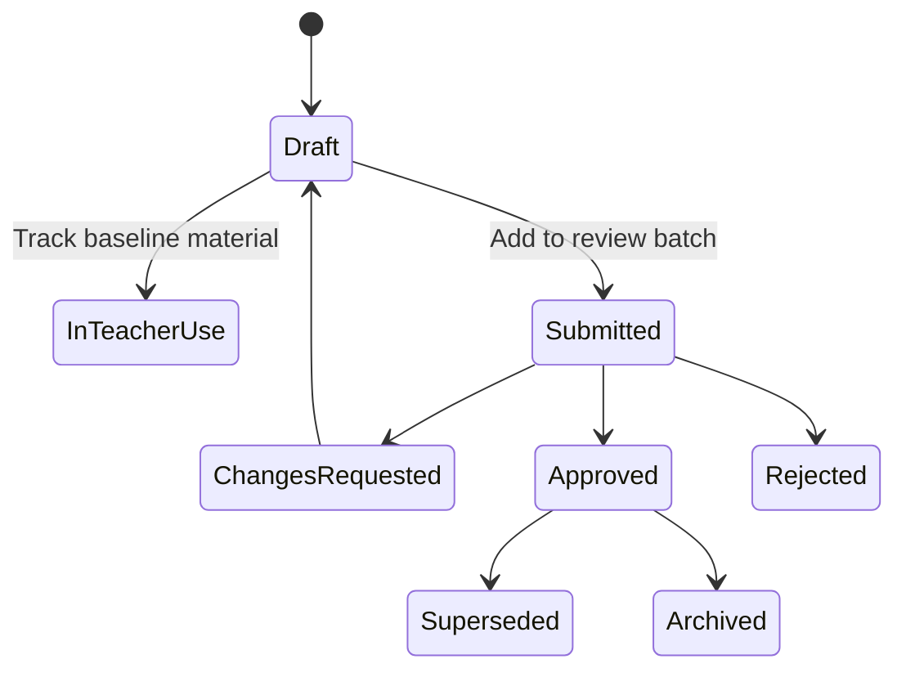
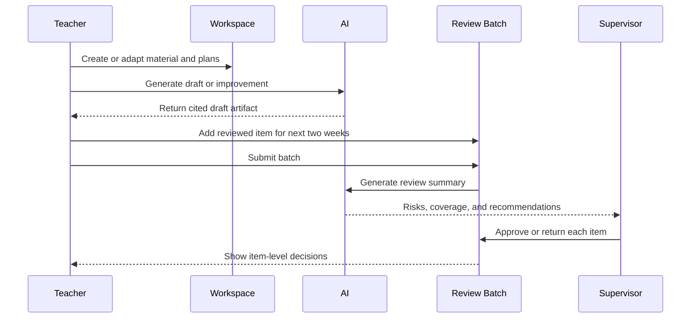

# Material Lifecycle and AI Artifact Management

## 1. Scope

This component governs institution-published teaching resources, teacher-created derivatives,
AI-generated artifacts, plan adaptations, and supervisor review.

It supports a biweekly preparation cycle:

1. The institution publishes trusted baseline material and plans.
2. Teachers use, track, adapt, or generate material for the next two weeks.
3. Teachers submit a two-week review batch.
4. AI creates a supervisor-facing report and recommendations.
5. The assigned supervisor reviews items individually.
6. Approved teacher materials and plan adaptations become usable in the teacher's assigned
   section(s).

## 2. Decisions

| Decision | Choice | Rationale |
| --- | --- | --- |
| Baseline content | Institution publishes trusted materials and plans | Teachers start from an approved, curriculum-aligned foundation. |
| Teacher adaptation | Teachers create linked derivative drafts | Preserves institutional source context and teacher ownership. |
| Review cadence | Biweekly submission batch | Matches preparation of the next two weeks while reducing review overhead. |
| Standard submission deadline | At least one week before the two-week window | Gives supervisors adequate time to review and return changes. |
| Review granularity | Individual item within a batch | A supervisor can approve ready work without blocking it on unrelated changes. |
| Supervisor scope | Assigned Grade within an academic period | Review access follows grade responsibility across all subjects, not institution-wide visibility. |
| Approved plan effect | Teacher's assigned section(s) only | A local adaptation must not silently rewrite the institutional plan. |
| Urgent material | Separate supervisor-approved submission | Supports unexpected needs without bypassing review and audit controls. |
| AI role | Draft generation and review summary | AI assists review but never grants approval. |

## 3. Roles

| Role | Responsibility |
| --- | --- |
| Institution administrator | Publishes baseline curriculum material and master plans; manages reviewer scope. |
| Teacher | Tracks baseline material, creates derivatives, prepares section plans, and submits review batches. |
| Supervisor | Reviews all subjects within assigned Grade–Academic Period scope; approves, returns, or rejects individual items. |
| AI service | Generates drafts, extracts metadata, provides citations, and summarizes review batches. |

The supervisor role is an academic permission, not a separate institution tenant. A supervisor
cannot access teacher work outside their assigned Grade–Academic Period scope.

## 4. Artifact types

| Artifact | Typical creator | Examples | Review requirement |
| --- | --- | --- |
| Institution baseline material | Administrator or approved central author | Textbook PDF, syllabus, reference slides, rubric | Published by institution workflow |
| Institution master plan | Administrator or approved central planner | Grade–Subject plan, topic sequence, learning outcomes | Published by institution workflow |
| Teacher tracked material | Teacher | A bookmark/reference to baseline material | No approval; read-only reference |
| Teacher derivative material | Teacher, optionally AI-assisted | Adapted worksheet, local slide deck, lesson notes | Supervisor approval before section use |
| AI draft artifact | AI, initiated by teacher | PPT outline, worksheet draft, quiz question draft | Teacher review then supervisor approval |
| Teacher plan adaptation | Teacher | Extra remedial session, revised activity, local pacing change | Supervisor approval before it becomes active |
| Review batch | Teacher | Two-week collection of material and plan submissions | Supervisor reviews individual items |

## 5. Artifact data model

The interface presents a folder-like workspace, but artifacts are stored as versioned relational
metadata plus object-storage files where applicable.

```text
MaterialArtifact
├── academic_period_id
├── grade_subject_offering_id
├── topic_id (optional for subject-wide material)
├── section_id (required for teacher section artifacts)
├── artifact_type
├── scope
├── lifecycle_status
├── owner_user_id
├── source_artifact_version_id (optional)
├── source_plan_version_id (optional)
├── current_version_id
└── approval metadata

MaterialArtifactVersion
├── artifact_id
├── version_number
├── content/blob reference
├── generated_by: human | AI | import
├── source citations
├── AI prompt and model metadata when applicable
├── change summary
└── immutable creation metadata
```

A derivative points to the exact baseline material version it used. This makes source attribution,
comparison, rollback, and auditability possible.

## 6. Lifecycle states

### 6.1 Teacher material lifecycle



- **Draft:** teacher-private work, including AI-generated output awaiting teacher review.
- **In teacher use:** a tracked institution baseline reference; it is not modified.
- **Submitted:** frozen version included in a biweekly review batch.
- **Changes requested:** supervisor returns the item with comments; teacher creates a new version.
- **Approved:** usable for the target section(s).
- **Rejected:** not usable; retained for audit.
- **Superseded:** replaced by a newer approved version.
- **Archived:** preserved as historical reference.

### 6.2 Institution baseline lifecycle

```text
Draft -> Internal review -> Published -> Superseded -> Archived
```

Teachers may reference any published baseline version. Publishing a newer baseline does not
silently alter an existing teacher derivative or approved section adaptation.

## 7. Plans use linked versions, not shared mutable objects

The institution master plan is the common baseline. A teacher's adaptation is a separate,
section-scoped proposal that references a master-plan session or plan version.

```text
Institution Grade 8 Mathematics master plan · v3
└── Linear equations · Session 4
    ├── Grade 8-A teacher adaptation · v1
    │   └── Extra remedial practice; approved
    └── Grade 8-B teacher adaptation · v1
        └── Extension activity; approved
```

After approval:

- Grade 8-A sees the approved remedial adaptation in its timetable and workspace.
- Grade 8-B continues with the baseline or its own approved adaptation.
- The institution master plan remains unchanged.
- Both users can navigate from the adaptation to the baseline it references.

This avoids conflicting edits while retaining the “same object” relationship through immutable
version references.

## 8. Biweekly review batch

### 8.1 Batch contents

A teacher creates one batch for a defined two-week window and adds:

- plan adaptations for upcoming sessions;
- teacher derivative materials;
- AI-generated draft artifacts that the teacher reviewed;
- a short teacher rationale and any known section need;
- links to baseline material, topic, and learning outcomes.

The batch is a submission container. Each item maintains its own status.

Teachers submit the batch at least one week before the target window begins. The system displays
the due date and warns when a batch is late. A late standard batch still follows normal review; it
does not become active automatically.

### 8.2 Submission workflow



### 8.3 Item-level outcomes

| Outcome | Effect |
| --- | --- |
| Approved | Item becomes active in its target section workspace. |
| Changes requested | Teacher receives comments and creates a new draft version. |
| Rejected | Item remains unavailable for use; reason is retained. |
| Deferred | Item remains submitted but requires a later decision; it is not active. |

The batch can contain a mix of these outcomes. Batch completion means every item has a terminal
decision: approved, rejected, or deferred.

### 8.4 Urgent submission

For an unexpected teaching need, a teacher may submit one material or plan adaptation outside the
normal batch cycle. The teacher must give an urgency reason and target session/date. The system
routes it only to the assigned supervisor, who can approve, request changes, or reject it using
the same item-level workflow.

Urgency does not bypass source citation, teacher review, authorization, or audit requirements.

## 9. AI artifact generation

Teachers can initiate AI generation from a topic, plan session, or approved baseline material.

### 9.1 Supported POC artifacts

- lesson-plan drafts;
- worksheet and practice-question drafts;
- PPT or slide-deck outlines;
- teacher notes and concept summaries;
- objective quiz-question drafts;
- adaptation suggestions based on approved material and authorized section data.

The POC may first generate structured outlines and editable source content. Rendering presentation
files such as `.pptx` is an implementation extension, not a replacement for teacher review.

### 9.2 Grounding and safety

The AI service must:

- retrieve only approved institutional sources and teacher-owned content the teacher may access;
- identify source citations in generated artifacts;
- treat uploaded or retrieved text as untrusted data, never as system instructions;
- avoid retrieving student records outside the teacher's assigned sections;
- record the model, prompt template, retrieval sources, and generation time;
- return an explicit insufficient-evidence response when approved sources do not support the
  request.

Generated content starts as a private draft. It cannot be used as approved section material until
the teacher reviews it and the supervisor approves it.

## 10. Supervisor AI review report

The supervisor receives an AI-generated summary for the batch, not an autonomous decision.

The report may include:

- items grouped by Grade, subject, topic, and section;
- planned learning-outcome coverage for the upcoming two weeks;
- links to each baseline source and teacher derivative;
- plan changes and their rationale;
- section pace relative to the master plan;
- risk flags, such as missing source citations, incomplete learning-outcome coverage, or a planned
  quiz without enough corpus questions;
- recommendations for reviewer attention;
- a clear statement that recommendations require human validation.

The report must not expose student-specific marks or information beyond the supervisor's assigned
scope. It must distinguish source facts, calculated metrics, and AI-generated interpretation.

## 11. Authorization and auditability

- Institution baseline material is read-only for teachers.
- Teachers can track published baselines without review.
- Teachers can create derivatives only in their active Grade–Subject–Topic–Section scope.
- Teachers can submit only their own drafts in a batch.
- Supervisors can review only batches and items within their assigned academic scope.
- An approved item is usable only in the section(s) named by the item.
- Every generation, edit, submission, reviewer action, and activation is auditable.
- A reviewer decision references the exact submitted artifact version, not a moving draft.

## 12. POC acceptance criteria

1. An administrator publishes a baseline material or master plan that is visible to authorized
   teachers.
2. A teacher can track a baseline artifact without copying or modifying it.
3. A teacher can create an AI-assisted or manual derivative linked to its source material.
4. AI-generated output starts as a private teacher draft with source citations and generation
   metadata.
5. A teacher can submit related plan adaptations and material drafts in one two-week batch.
6. The system creates a supervisor-facing AI summary when the batch is submitted.
7. A supervisor can approve, request changes, reject, or defer individual items.
8. An approved adaptation becomes active only for the teacher's assigned section(s).
9. The institutional baseline plan remains unchanged after local adaptation approval.
10. The teacher and supervisor can trace every approved local artifact to its baseline version.
11. The system shows a submission deadline one week before the target review window.
12. An urgent item requires a reason and assigned-supervisor decision before activation.

## 13. Deferred scope

- Supervisor editing of teacher drafts
- Automatic publication without human review
- Sharing teacher derivatives with other teachers
- Institution-wide promotion of a teacher's local adaptation
- `.pptx` rendering and branded presentation templates
- Collaborative editing and concurrent edit conflict resolution
- Cross-period artifact synchronization rather than explicit copy/version actions
- Automated quality scoring as an approval substitute

## 14. Open decisions

- Can a teacher use an already approved prior-period derivative by copying it into the new period?
- Do supervisors see only the AI summary first, or the full item list and summary together?
- What material file types and maximum file sizes does the POC support?
