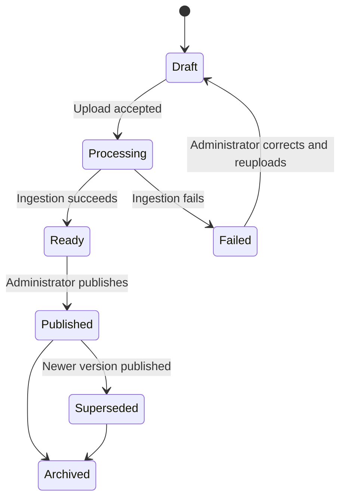

# Material Lifecycle and Source Curriculum

## 1. Scope and non-goals

This component owns the administrator **SourceCurriculum** directory: Grade → Subject → Topic →
Subtopic folders, published source material versions, ingestion into searchable chunks, and the
publication rules that make common content visible to enrolled students.

It supports the student-evaluation POC:

1. The administrator creates or copies a Grade–Subject curriculum folder structure.
2. The administrator uploads source material under a subtopic and publishes an immutable version.
3. The platform stores the original file, extracted text, chunks, and metadata for retrieval.
4. Enrolled students receive a private StudentLearningDirectory entry that references the published
   version; the shared source is not duplicated per student.
5. A common mastery quiz for that subtopic may be released only after its material is published.

Learner presentation and progress UX are defined in
[Student learning experience](./01-student-learning-experience.md). Enrollment gates are defined in
[Academic structure](./03-academic-structure-enrollment-and-timetable.md).

### Non-goals for the POC

- Teacher-authored derivatives and remedial modules
- Supervisor review batches
- Private AI-generated dynamic material versions per student
- Automatic rewriting of common source material from evaluation evidence
- Section-specific or learner-specific material assignment

## 2. Decisions

| Decision | Choice | Rationale |
| --- | --- | --- |
| Content ownership | Administrator publishes common source material | One trusted baseline for every enrolled Grade–Subject student. |
| Folder hierarchy | AcademicPeriod → Grade → Subject → Topic → Subtopic | Reusable rollout path for materials and quizzes. |
| Student delivery | Virtual StudentLearningDirectory references published versions | Personal progress without duplicating shared files. |
| Versioning | Immutable published versions | Completed study and quiz history stay stable when a newer source is published. |
| Quiz gate | Common mastery quiz may release only after material is published | Students are assessed on content they could study. |
| Teacher adaptation | Deferred | Keeps the POC focused on common curriculum and evaluation. |
| AI role in POC | Index published sources for later grounded retrieval | Personalization and dynamic material generation are future phases. |

## 3. Actors and authorization

| Role | Responsibility |
| --- | --- |
| Institution administrator | Creates folders, uploads sources, publishes/supersedes/archives versions |
| Teacher | Reads published source materials within teaching assignment scope; cannot publish common sources in the POC |
| Student | Reads only published source versions referenced by their StudentLearningDirectory after Grade–Subject enrollment checks |

## 4. Folder and entity model

```text
SourceCurriculum
└── AcademicPeriod
    └── Grade
        └── Subject
            └── Topic
                └── Subtopic
                    ├── SourceMaterialVersions
                    │   └── PublishedVersion
                    └── CommonMasteryQuiz
                        └── PublishedVersion
```

| Entity | Key fields | Notes |
| --- | --- | --- |
| SourceMaterial | institution, period, grade, subject, topic, subtopic, title, status | Folder leaf for a teachable content package |
| SourceMaterialVersion | material_id, version_number, blob_ref, checksum, lifecycle_status | Immutable once published |
| SourceChunk | version_id, ordinal, text, page/section metadata | Produced by ingestion for search/AI |
| StudentMaterialProgress | student_id, material_version_id, opened_at, completed_at, status | Lives in the student directory, not the source directory |

Folders are a navigation model. Persistence is relational plus object storage for blobs.

## 5. Publication lifecycle



Rules:

- A draft or processing version is invisible to students.
- Publishing creates an immutable published version and makes it eligible for StudentLearningDirectory
  resolution for enrolled Grade–Subject students.
- Publishing a newer version supersedes the previous published version for **new** study sessions.
- Existing StudentMaterialProgress and quiz attempts continue to reference the exact version the
  student used; history is never silently rewritten.
- Archiving removes the material from new learner resolution while retaining audit and historical
  references.

## 6. Ingestion and storage

When an administrator uploads a source file:

1. Validate institution ownership, folder path, file type, and size.
2. Store the original blob immutably in object storage (or local adapter in development).
3. Parse PDF/DOCX/TXT into normalized text.
4. Chunk text with stable identifiers and page/section metadata.
5. Persist chunks and optional embeddings for later retrieval.
6. Mark the version `ready` or `failed` with an observable reason.

Uploaded and extracted text are untrusted data. They never become system instructions.

## 7. Relationship to the student directory

```text
SourceCurriculum/.../LinearEquations/SourceMaterialVersions/v1
        ^
        | reference only
StudentLearningDirectory/.../LinearEquations/SourceMaterialReference -> v1
StudentLearningDirectory/.../LinearEquations/MaterialProgress
```

Resolution algorithm for a student material request:

```text
1. Authenticate student and confirm active account
2. Confirm resource institution matches user institution
3. Confirm active academic period
4. Confirm active Grade enrollment
5. Confirm active Grade–Subject enrollment
6. Resolve latest published SourceMaterialVersion for the subtopic
   (or the version already bound to an in-progress progress record)
7. Return material payload plus the student's progress state
```

Client-supplied grade/subject/student identifiers are not proof of access.

## 8. Publish rules for quizzes

- A CommonMasteryQuiz version may be released only when its subtopic has at least one published
  SourceMaterialVersion.
- Releasing a quiz binds the quiz version to the material version set intended for that assessment
  window.
- Later material supersession does not alter already-released quiz bindings or scored attempts.

Quiz authoring details live in
[Assessment: common subtopic mastery quizzes](./05-assessment-common-subtopic-mastery-quizzes.md).

## 9. Failure handling and observability

| Condition | System behavior |
| --- | --- |
| Unsupported or corrupt file | Mark version failed; retain upload audit; do not publish |
| Ingestion retry exhausted | Remain failed with reason; administrator may reupload |
| Publish without ready version | Reject publish |
| Quiz release without published material | Reject release |
| Student requests unpublished material | Not found / unavailable; no existence leak across enrollments |

Every upload, ingest result, publish, supersede, and archive action is audited.

## 10. POC acceptance criteria

1. An administrator can create AcademicPeriod → Grade → Subject → Topic → Subtopic folders.
2. An administrator can upload and publish an immutable source material version under a subtopic.
3. Ingestion stores blob, text chunks, and status for the published version.
4. Enrolled Grade–Subject students resolve the published version through their private directory.
5. Students without Grade or Grade–Subject enrollment cannot discover or open the material.
6. Publishing a newer version does not rewrite prior student progress or quiz version references.
7. A common mastery quiz cannot be released until material for that subtopic is published.

## 11. Deferred scope

- Teacher derivatives, remedial modules, and supervisor review batches
- Private dynamic material versions generated from source chunks and student evaluation
- Institution-wide promotion of teacher local adaptations
- Collaborative editing and concurrent edit conflict resolution
- Automatic quality scoring as a publish substitute

## 12. Open decisions

- Should standard materials default to grade-wide Grade–Subject visibility only, with no section
  filter ever, even for reporting?
- What material file types and maximum sizes does the POC support beyond PDF/DOCX/TXT?
- Can an administrator copy a prior-period SourceCurriculum into a new period as new version
  records?
