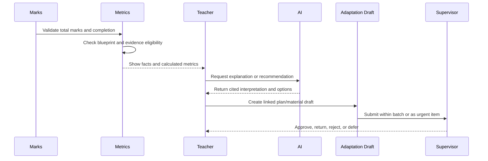

# Analytics and Comparison Insights

## 1. Scope

This component turns plan progress, approved section adaptations, quiz blueprints, and teacher-entered
marks into evidence-based insights for teachers.

The POC supports comparisons across sections only when they share the same:

```text
Academic period
+ Grade
+ Subject
+ Topic
+ Master assessment blueprint version
```

It does not rank students, expose comparison insights to supervisors, or change plans automatically.

## 2. Decisions

| Decision | Choice | Rationale |
| --- | --- | --- |
| Mastery threshold | Institution default; teacher may propose a scoped override for supervisor approval | Provides consistency while allowing justified academic variation. |
| Minimum comparison evidence | At least 5 marked students and 80% completion in each section | Avoids over-interpreting small or incomplete samples. |
| Comparison audience | Assigned teacher only | Section performance remains private during the POC. |
| AI action | Create a linked draft adaptation or material request | AI can assist action planning without changing active plans automatically. |
| Supervisor analytics | Not included in the POC | Supervisors receive material/plan batch reports, not marks comparisons. |
| Data entry | Offline quiz total marks and missing-submission status | Matches the selected assessment-delivery POC. |

## 3. Evidence model

The system must label every output by its evidence type.

| Type | Definition | Example |
| --- | --- | --- |
| Source fact | An immutable recorded event or value | Grade 8-A quiz total: 30 marks; 18 students enrolled. |
| Calculated metric | A deterministic calculation from source facts | Grade 8-A average: 21.4/30; completion: 94%. |
| Comparison | A calculated relationship between eligible sections | Grade 8-A mastery rate is 12 percentage points below Grade 8-B. |
| AI interpretation | A non-authoritative explanation or suggestion | Consider one extra remedial session on inverse operations. |
| Teacher action draft | A proposed material or plan adaptation | Draft a Grade 8-A practice session linked to the low mastery evidence. |

AI interpretations must link to the facts and metrics that support them. They cannot be displayed
as proven causes.

## 4. Eligibility for comparison

### 4.1 Blueprint equivalence

Two section variants are comparable only if generated from the same master blueprint version. The
questions may differ, but must have the same:

- Grade, subject, and academic period;
- topic and intended learning-outcome coverage;
- assessment duration and total marks;
- marks and question count by difficulty bucket;
- question types required by the blueprint.

### 4.2 Minimum evidence

For each section:

```text
marked_students >= 5
AND
marked_students / enrolled_students_at_assessment >= 0.80
```

If either condition fails, the platform returns:

```text
Comparison status: insufficient evidence
Reason: Grade 8-A has 4 marked students; minimum is 5.
```

The UI may still show each section's standalone facts and metrics, but it must not produce a
section-versus-section conclusion.

### 4.3 Exclusions

The POC excludes a result from comparison when:

- the quiz variant was not approved before delivery;
- the variant does not match the selected blueprint version;
- the assessment was cancelled or marked invalid;
- the section had no active teacher assignment at the assessment date;
- total mark data is missing, outside the allowed range, or under correction;
- the section fails the minimum-evidence rule.

## 5. Metrics

### 5.1 Assessment attainment

| Metric | Definition |
| --- | --- |
| Enrolled students | Active students in the section at the assessment date |
| Marked students | Students with a valid total mark |
| Missing submissions | Students with missing or absent status |
| Completion rate | Marked students divided by enrolled students |
| Mean score | Sum of valid marks divided by marked students |
| Median score | Middle score among valid marks |
| Score distribution | Count of students in configured score bands |
| Mastery rate | Students meeting the active mastery threshold divided by marked students |
| Pass rate | Students meeting the institution-defined pass threshold divided by marked students |

### 5.2 Plan and pace

| Metric | Definition |
| --- | --- |
| Expected topic | Topic from the master-plan session at a timetable occurrence |
| Actual topic | Topic recorded by the teacher after the session |
| Pace delta | Actual progress relative to the master-plan sequence or date |
| Adaptation count | Approved section adaptations for a topic or period |
| Adaptation reason | Remediation, enrichment, event, attendance, or other approved reason |
| Material readiness | Approved required materials present for an upcoming session |

### 5.3 Outcome and difficulty analysis

The initial offline mark-entry POC records total marks. It supports:

- assessment-level attainment;
- blueprint-level difficulty coverage;
- plan alignment;
- trend comparison across equivalent assessments.

It does **not** reliably support question-level misconceptions or learning-outcome correctness
until detailed question-level marks or online submissions are introduced. POC comparison is
therefore at the matching topic-and-blueprint level.

## 6. Mastery thresholds

The institution configures default mastery and pass thresholds. A blueprint uses the current
institution default unless an approved override exists.

```text
Institution default mastery threshold: 70%
Institution default pass threshold: 50%

Grade 8 Mathematics · Linear equations blueprint:
  Uses 70% mastery threshold
```

A teacher can propose a different threshold with a rationale in the two-week review batch. The
override becomes active only after the assigned supervisor approves it, and applies only to its
defined Grade–Subject–Topic or blueprint scope.

## 7. Teacher insight workflow



### 7.1 Example insight

```text
Observed facts
- Grade 8-A: 16 marked students out of 18 enrolled, 89% completion
- Grade 8-B: 17 marked students out of 18 enrolled, 94% completion
- Both variants use Linear Equations Blueprint v2

Calculated metrics
- Grade 8-A mastery: 44%
- Grade 8-B mastery: 71%
- Difference: 27 percentage points

AI interpretation
- Grade 8-A is eligible for comparison and has lower mastery on an equivalent blueprint.
- Consider an additional practice session focused on inverse operations.

Available action
- Create a Grade 8-A remedial-session adaptation draft linked to this comparison.
```

## 8. Recommendations and actions

An AI recommendation can create a prefilled **draft**, not an active intervention. The draft
contains:

- target academic period, Grade–Subject, topic, and section;
- links to the relevant master-plan session, quiz blueprint, and calculated metrics;
- proposed adaptation or material type;
- suggested rationale;
- source citations and generation metadata.

The teacher edits the draft and submits it through the existing biweekly batch or urgent-review
workflow. Supervisor approval is required before it affects the section's active plan or materials.

## 9. Authorization and privacy

- A teacher sees only facts, metrics, comparisons, and AI interpretations for their active teaching
  assignments.
- A teacher sees a cross-section comparison only when assigned to both sections.
- Supervisors do not see assessment comparison dashboards or student marks in the POC.
- Administrators manage defaults and source data but do not receive an analytics dashboard in this
  component's POC scope.
- Student identifiers are minimized in comparison views; aggregate results are the default.
- Every calculation input, metric version, recommendation, and draft action is auditable.

## 10. Failure handling

| Condition | System behavior |
| --- | --- |
| Insufficient marked students | Show standalone metrics; suppress comparison and AI conclusion. |
| Completion below 80% | Show standalone metrics; explain the missing-submission rate. |
| Blueprint mismatch | Block comparison and identify the incompatible blueprint versions. |
| Invalid or corrected mark | Exclude from metric calculation until correction is resolved. |
| Missing plan data | Show assessment metrics, but mark pace analysis unavailable. |
| AI service unavailable | Keep deterministic metrics visible; hide or retry AI interpretation. |

## 11. POC acceptance criteria

1. The platform calculates attainment metrics from valid offline total-mark entries.
2. It compares sections only when the academic period, Grade, subject, topic, and blueprint
   version match.
3. It suppresses comparison when either section has fewer than 5 marked students or completion
   below 80%.
4. It shows source facts separately from calculated metrics and AI interpretation.
5. Teachers see comparison insights only for sections they teach.
6. Supervisors do not receive assessment comparison or student-mark views.
7. An AI recommendation can create a linked adaptation or material draft, but cannot activate it.
8. Threshold overrides require teacher rationale and supervisor approval.

## 12. Deferred scope

- Question-level response analysis
- Learning-outcome misconception detection from responses
- Online quiz attempts, completion time, and automatic scoring
- Student ranking and learner-facing dashboards
- Supervisor or leadership assessment dashboards
- Predictive models and personalized learning recommendations
- Institution-configurable comparison evidence rules
- Statistical calibration, item-response theory, and causal impact claims

## 13. Open decisions

- Should teachers see a trend view across multiple equivalent blueprints, or only the latest
  assessment in the POC?
- Which score bands should the institution use for distributions?
- How long after a mark correction should metrics and AI recommendations be recalculated?
