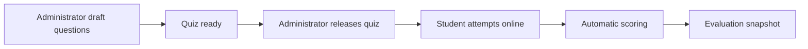

# Assessment: Common Subtopic Mastery Quizzes

## 1. Scope

This component creates one common objective mastery quiz per subtopic and delivers it online to
every student enrolled in the Grade–Subject offering.

```text
SourceCurriculum
└── AcademicPeriod · 2026–27
    └── Grade 8
        └── Mathematics
            └── Algebra
                └── Linear equations
                    ├── SourceMaterialVersions
                    └── CommonMasteryQuiz
                        └── Student online attempts + auto scores
```

Student attempt UX is defined in
[Student learning experience](./01-student-learning-experience.md). Metric formulas are defined in
[Analytics and comparison insights](./06-analytics-and-comparison-insights.md).

## 2. Decisions

| Decision | Choice | Rationale |
| --- | --- | --- |
| Quiz unit | One common mastery quiz per Grade–Subject–Subtopic | All eligible students share the same assessment baseline. |
| Authoring | Administrator-managed objective questions | Aligns with common SourceCurriculum ownership. |
| Question tagging | Every question maps to the subtopic and at least one learning outcome | Enables valid struggle analysis. |
| Delivery | Online React / React Native API delivery with automatic objective scoring | Matches the student-evaluation goal. |
| Result release | Administrator-configured institution default | Keeps cohort evaluation rules consistent. |
| Retakes | Administrator-configured maximum | Supports recovery without teacher-specific differences. |
| Comparison basis | Same published quiz version | Directly supports fair peer context. |
| Adaptive practice | Deferred | Requires a large approved corpus and separate privacy rules. |
| Section variants | Deferred | POC uses one common quiz for the Grade–Subject cohort. |
| Live AI question generation | Deferred | Unreviewed live questions are not auditable enough for the POC. |

## 3. Core concepts

### Subtopic / learning outcome

A measurable statement under a subtopic. Example:

> Solve single-variable linear equations using inverse operations.

Every question must map to the parent subtopic and at least one learning outcome.

### Question

A reusable, versioned assessment item with:

- Grade, subject, topic, subtopic;
- learning outcome tags;
- question type;
- optional difficulty metadata;
- prompt, options/correct answer, marks;
- optional student-safe explanation;
- publication status.

### Common mastery quiz

An immutable published quiz version for one Grade–Subject–Subtopic. Every enrolled student attempts
the same question set (subject to retake policy and attempt windows).

### Online attempt

A student's timed interaction with a released quiz version. Answers are scored automatically and
stored against immutable question versions.

## 4. Question and quiz lifecycle



Rules:

- A quiz may be released only after the subtopic's source material is published.
- Release binds the quiz version to the intended material version set for that window.
- Later question edits create new versions; already scored attempts keep prior versions.
- AI-assisted authoring, teacher review batches, blueprints, and section variants are future
  evolution paths, not POC requirements.

## 5. Objective question types in the POC

| Type | Marking approach |
| --- | --- |
| Multiple choice | Exact option match |
| True/false | Exact boolean match |
| Matching | Exact mapping match |
| Short numeric answer | Normalized numeric comparison |

Open-ended answers, essays, handwritten work, and AI-only grading are excluded.

## 6. Online delivery, scoring, and release

### 6.1 Release workflow

1. Administrator prepares objective questions for the subtopic.
2. Administrator configures duration, attempt window, maximum attempts, and release mode
   (`immediate` or `admin_release`).
3. Administrator marks the quiz released for the Grade–Subject–Subtopic.
4. Enrolled students may start attempts during the window.

### 6.2 Attempt and scoring rules

1. Starting an attempt freezes the quiz question set and timing for that attempt.
2. The student may save answers while `InProgress`.
3. Submit or timer expiry locks answers.
4. The platform scores each objective item deterministically.
5. Question-level correctness and learning-outcome tags are persisted as source facts.
6. Total marks, percentage, and pass/mastery flags are calculated.
7. Analytics writes a versioned evaluation snapshot into the StudentLearningDirectory.

### 6.3 Offline fallback

If online delivery is impossible for an exceptional case, an administrator or assigned teacher may
enter total marks through an audited manual path. Manual total-mark-only entries do **not** unlock
subtopic struggle analysis until question-level data exists.

## 7. Comparison eligibility

Compare only common mastery attempts that share:

```text
Academic period
+ Grade
+ Subject
+ Topic
+ Subtopic
+ Common mastery quiz version
```

Adaptive or individualized practice attempts, when introduced later, must not enter peer comparison.

## 8. Authorization and auditability

- Only administrators publish and release common mastery quizzes in the POC.
- A student can attempt only released quizzes for active Grade–Subject enrollments.
- Teachers can view assigned-group aggregates and individual results; they cannot alter another
  cohort's quiz content.
- The platform stores quiz version, question versions, release time, attempt timing, answers,
  scores, and corrections.
- A scored attempt cannot be altered without an audited correction that recalculates dependent
  metrics.

## 9. POC acceptance criteria

1. An administrator can publish one common objective quiz for a Grade–Subject–Subtopic.
2. Every published question has subtopic and learning-outcome tags.
3. The quiz cannot be released until source material for that subtopic is published.
4. An enrolled student can attempt the released quiz online and receive an automatic objective score.
5. Scored attempts persist question-level and learning-outcome correctness.
6. Results become student-visible according to the configured release policy.
7. Teachers can view assigned-group aggregates; students see only own results plus anonymized peer
   context.

## 10. Deferred scope

- Large approved question corpus with difficulty buckets and exposure limits
- Adaptive practice quizzes assembled per student from unseen corpus items
- Teacher/AI question authoring with supervisor approval
- Blueprints and section variants
- Per-student unique mastery variants
- Subjective evaluation, rubrics, and proctoring
- Formal psychometric calibration

## 11. Open decisions

- Default mastery and pass thresholds?
- Default maximum retakes?
- Immediate versus administrator-gated result release as the institution default?
- Minimum question count per common mastery quiz?
