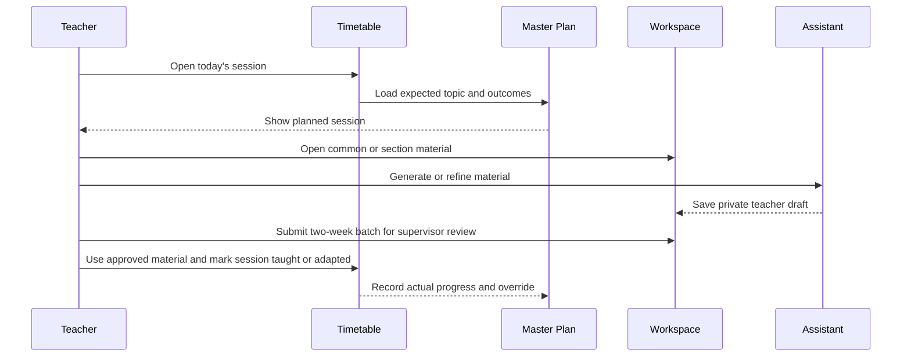

# Teacher Workspace and Academic Planning

## 1. Scope

This component provides the teacher's primary workspace: a chat-led landing page, timetable, shared
subject materials, section-specific materials, remediation authoring, class performance insights,
and curriculum-aligned planning.

The overall product is student-evaluation-centric. For the POC, administrators publish the
SourceCurriculum that enrolled students consume through private StudentLearningDirectory views;
teachers inspect assigned-group evidence after common mastery quiz attempts. Teacher-authored
material, remediation authoring, adaptive practice, and advanced planning are later extensions.
See [Student learning experience](../01-student-learning-experience.md) and
[Analytics and comparison insights](../06-analytics-and-comparison-insights.md).

It establishes the academic hierarchy used by assessment and analytics:

```text
Institution
└── Academic period
    ├── SourceCurriculum
    │   └── Grade → Subject → Topic → Subtopic
    │       ├── SourceMaterialVersions
    │       └── CommonMasteryQuiz
    └── Teacher assignment
        └── Grade + Subject (+ optional section)
            ├── Read published SourceCurriculum materials
            └── Class insights for assigned enrolled students
```

Example:

```text
Academic period · 2026–27
└── Grade 8
    └── Mathematics
        ├── Master plan
        ├── Subject-wide common materials
        ├── Topics
        │   ├── Linear equations
        │   │   ├── Learning outcomes
        │   │   ├── Common materials
        │   │   ├── Quiz corpus and master blueprint
        │   │   └── Planned sessions
        │   └── Quadratic equations
        │       ├── Learning outcomes
        │       ├── Common materials
        │       ├── Quiz corpus and master blueprint
        │       └── Planned sessions
        ├── Grade 8-A
        │   ├── Session overrides
        │   ├── Section materials
        │   └── Topic quiz variants and results
        └── Grade 8-B
            ├── Session overrides
            ├── Section materials
            └── Topic quiz variants and results
```

## 2. Decisions

| Decision | Choice | Rationale |
| --- | --- | --- |
| Teaching assignment | Subject + section | A teacher may teach different subjects and sections independently. |
| Academic context | Multiple first-class academic periods; one active at a time | Planning, assessment, and records remain historically valid while teachers have one current workspace. |
| Shared workspace scope | Grade + subject for the same teacher | Mathematics material for Grade 8-A and Grade 8-B is reusable, but does not leak into unrelated subjects. |
| Default plan | Grade–Subject master plan | Avoids duplicated plans and gives analytics a single expected pace. |
| Section variance in the POC | Session-level override | Captures local progress without prematurely duplicating the full plan. |
| Long-running section divergence | Deferred | A multi-week plan fork is useful only after the POC proves the need and reporting rules. |

## 3. Teacher landing experience

After login, the teacher sees three primary surfaces:

1. **Assistant chat** — ask questions, create lesson material, prepare quizzes, draft remediation,
   and retrieve approved curriculum content.
2. **Timetable** — today and upcoming sessions, including grade, section, subject, planned topic,
   and current progress status.
3. **Class insights** — assigned-section completion, score distributions, common weak subtopics,
   trends, and links to create remediation drafts.

The workspace opens in the teacher's active academic period. Previous periods remain available as
an archive, read-only by default, so a teacher can inspect prior plans, materials, and results
without accidentally altering historical records.

The teacher can open a timetable session to:

- read the master-plan expectation;
- see any existing section override;
- prepare or attach materials and remedial modules;
- generate a lesson plan or quiz from approved content;
- release approved section quizzes to enrolled learners;
- inspect assigned-section results after online attempts;
- record the session as taught, delayed, cancelled, or adapted;
- add an adaptation reason such as remediation, enrichment, holiday, or low attendance.

## 4. Academic model

### Grade

A grade is the academic cohort, such as **Grade 8**.

### Academic period

An academic period is an institution-defined period, such as **2026–27**. The institution retains
multiple periods but operates exactly one active period at a time. Every teaching assignment, enrollment, timetable,
master plan, section override, material, quiz variant, and mark record belongs to exactly one
academic period.

Materials and corpus questions from an earlier period may be explicitly copied into a new period as
new versions. They are never silently shared across periods.

### Section

A section is a teachable group inside a grade, such as **Grade 8-A** or **Grade 8-B**. Students
belong to a section for a defined academic period.

### Subject

A subject is the academic discipline, such as Mathematics. It may have its own curriculum,
learning outcomes, resources, and assessment taxonomy.

### Topic

A topic is a teachable unit within a Grade–Subject workspace, such as Linear Equations or
Quadratic Equations. It groups the learning outcomes, planned sessions, common materials,
question corpus, and master quiz blueprint used to teach and assess that unit.

The logical key for topic-scoped work is:

```text
Academic period + Grade + Subject + Topic
```

Section-specific work adds the assigned section to that key:

```text
Academic period + Grade + Subject + Topic + Section
```

### Teaching assignment

A teaching assignment connects one teacher to one subject and one section for an academic period.

Examples:

- Teacher A → Mathematics → Grade 8-A
- Teacher A → Mathematics → Grade 8-B
- Teacher A → Physics → Grade 9-A

The platform derives the teacher's Grade–Subject workspace by grouping compatible assignments:

```text
Teacher + Academic period + Grade 8 + Mathematics
    -> Grade 8-A assignment
    -> Grade 8-B assignment
```

## 5. Master plan and section overrides

### 5.1 Master plan

The master plan represents the intended sequence for one Grade–Subject during an academic period.
It contains milestones and planned sessions:

- date or week;
- topic and learning outcomes;
- expected duration;
- suggested materials;
- planned assessment checkpoint;
- curriculum/source references.

The master plan is the shared baseline. It is not overwritten when one section varies.

### 5.2 Session-level section override

A section override modifies one scheduled session while preserving its link to the master session.
It can change:

- planned date or duration;
- topic pacing;
- materials;
- activity or differentiation;
- status;
- adaptation reason;
- teacher note.

Examples:

| Master session | Grade 8-A | Grade 8-B |
| --- | --- | --- |
| Linear equations, 45 minutes | Extra practice because quiz performance was low | Extension problems because the class finished early |
| Quadratic introduction | Delayed one session due to school event | Taught as planned |

### 5.3 Future: section-plan forks

A section may eventually need a multi-week divergence. This will be modeled as a controlled fork:

- fork begins from a named master-plan session;
- each changed session tracks its parent;
- teachers can compare planned and actual pacing;
- a fork requires a reason and may require academic-lead approval;
- rejoining the master plan must be explicit.

This is out of scope for the POC.

## 6. Material organization

The product should behave like a project workspace, not an unmanaged file upload area. Teachers
should browse a clear conceptual hierarchy while the database stores metadata rather than relying
on paths as the source of truth.

### 6.1 Logical folders

```text
My workspace
├── 2026–27 (active)
│   └── Grade 8 Mathematics
│       ├── Subject-wide materials
│       │   ├── Master plan
│       │   ├── Concepts and references
│       │   └── Shared cross-topic lesson resources
│       ├── Topics
│       │   ├── Linear equations
│       │   │   ├── Learning outcomes
│       │   │   ├── Common materials
│       │   │   ├── Quiz corpus
│       │   │   │   ├── Easy
│       │   │   │   ├── Medium
│       │   │   │   ├── Hard
│       │   │   │   └── Extra hard
│       │   │   ├── Master quiz blueprints
│       │   │   └── Planned sessions
│       │   └── Quadratic equations
│       ├── Grade 8-A
│       │   ├── Topic session materials
│       │   ├── Topic adaptations
│       │   └── Topic quiz variants and marks
│       └── Grade 8-B
│           ├── Topic session materials
│           ├── Topic adaptations
│           └── Topic quiz variants and marks
└── 2025–26 (archive, read-only by default)
    └── Grade 8 Mathematics
```

### 6.2 Material scopes

| Scope | Who can use it | Typical examples |
| --- | --- | --- |
| Institution-approved | Authorized teachers in the institution | Curriculum, syllabus, approved rubric |
| Institution baseline | Authorized teachers in the institution | Published curriculum, master plan, approved source material |
| Teacher Grade–Subject common | That teacher's compatible sections after approval | Shared slide deck, common worksheet, approved local material |
| Topic common | That teacher's compatible sections for the topic after approval | Topic notes, approved question corpus, master blueprint |
| Section-specific | The teacher's assignment for one section | Remedial worksheet, session adaptation, section quiz variant |
| Private draft | Creating teacher only | Unpublished notes or generated material |

### 6.3 Creation flow

1. A teacher starts in chat or a workspace folder.
2. They choose material type, Grade–Subject workspace, topic when applicable, and scope.
3. The system proposes a name and metadata based on the active topic, plan, and session.
4. The teacher reviews, edits, and saves the material as a private draft.
5. The teacher submits the material with related plan adaptations in the two-week review batch.
6. The assigned supervisor approves, returns, rejects, or defers each item.
7. The platform activates approved items in the logical workspace and records author, source
   references, version, creation method, visibility, and review decision.

Suggested naming convention:

```text
YYYY-MM-DD__grade-8__mathematics__linear-equations__lesson-plan__v01
YYYY-MM-DD__grade-8-a__mathematics__linear-equations__practice-sheet__v01
YYYY-MM-DD__grade-8__mathematics__linear-equations__quiz-corpus__medium__v01
```

The UI should generate names; teachers should not have to memorize the format.

## 7. Timetable flow



## 8. Data ownership

| Entity | Owned by | Notes |
| --- | --- | --- |
| Academic period, grade, section, subject | Academic structure | Institution-managed reference data |
| Teaching assignment | Academic structure | Defines access to section workspaces |
| Topic and learning outcome | Academic structure | Grade–Subject curriculum units and measurable objectives |
| Master plan and master sessions | Planning | Shared Grade–Subject baseline; each session references a topic |
| Section override | Planning | References one master session |
| Material metadata and versions | Content | Stores logical scope, topic, and source relationships |
| Question corpus and blueprint | Assessment | Topic-scoped approved questions and variant rules |
| File/blob | Storage | Immutable physical object keyed by version |
| Timetable slot | Scheduling | Links assignment and planned/actual session |
| Progress event | Analytics | Immutable observation, not a replacement for plan data |

## 9. Authorization

- A teacher can view and modify only workspaces derived from their active teaching assignments.
- A teacher can create common material only in their own compatible Grade–Subject workspace, but
  it remains a private draft until supervisor approval.
- A teacher can create section-specific material only for their assigned section, and it remains a
  private draft until supervisor approval.
- Institution-approved sources are read-only to teachers unless a separate authoring workflow grants
  edit rights.
- Teachers may not expose material or student-related data to another institution.
- Assigned supervisors review teacher batches and approve section-scoped materials and plan
  adaptations; they do not change the teacher's ownership model or institutional baseline.

## 10. Analytics enabled by this design

The common master plan makes section comparisons meaningful. For each section, the platform can
measure:

- expected topic versus actual topic;
- expected pace versus actual pace;
- number and reason of session adaptations;
- time spent on remediation or enrichment;
- marks and quiz performance by topic and equivalent blueprint;
- performance after a specific adaptation;
- sections falling behind the shared plan.

Analytics must show the data source and label conclusions as either observed facts, calculated
metrics, or AI-generated recommendations.

## 11. POC acceptance criteria

1. A teacher with Mathematics assignments for Grade 8-A and Grade 8-B sees one Grade 8 Mathematics
   common workspace and both section workspaces.
2. The teacher can create a common material draft once and submit it for supervisor approval.
3. An approved common artifact is visible in both compatible section contexts.
4. The teacher can create a section-specific draft visible only to the selected section after
   supervisor approval.
5. The timetable opens a planned session with its master topic and learning outcomes.
6. The teacher can submit a section-level session adaptation without modifying the master plan.
7. The system records an approved adaptation reason and exposes it for future analytics.
8. A teacher without a matching assignment cannot access the workspace, materials, or timetable
   session.

## 12. Deferred decisions

- Whether common teacher material can be shared with other teachers teaching the same subject
- Whether materials can be linked to multiple subjects or multiple Grade–Subject workspaces
- Multi-week section-plan forks and rejoining behavior
